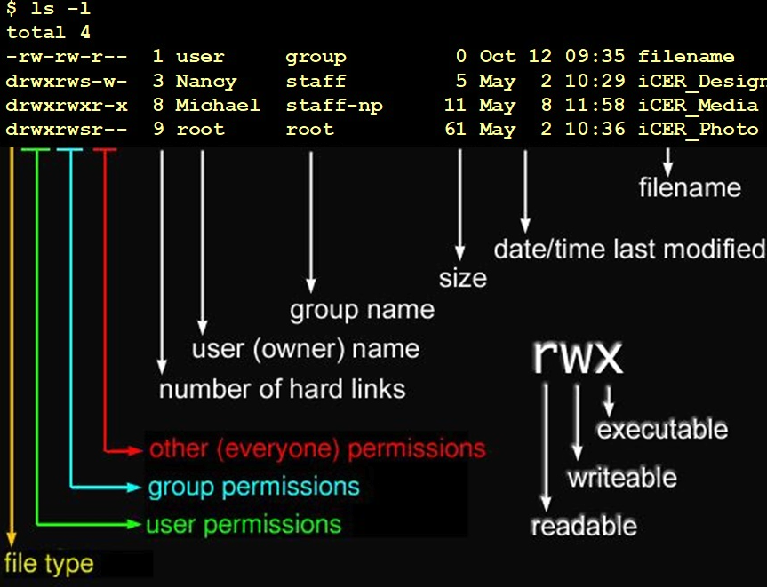

## Sumário

- [Diferenças entre terminal e shell](#diferencas-entre-terminal-e-shell)
  - [Funcionamento do Shell Bash](#funcionamento-do-shell-bash)
  - [Arquivos de configuracao do Bash](#arquivos-de-configuracao-do-bash)
- [Variáveis em Shell](#variaveis-em-shell)
  - [ Variaveis especiais do shell Linux](#variaveis-especiais-do-shell-linux)
  - [Caracteres curinga no shell](#caracteres-curinga-no-shell)
- [Entendendo o Prompt do terminal linux](#entendendo-o-prompt-do-terminal-linux)
- [Camadas da arquitetura do Linux](#camadas-da-arquitetura-do-linux)
  - [Inicializacao do sistema](#inicializacao-do-sistema)
- [Estrutura de Diretórios Importantes](#estrutura-de-diretorios-importantes)
  - [Controle de bibliotecas compartilhadas](#controle-de-bibliotecas-compartilhadas)
- [Pacotes](#pacotes)
  - [Comandos para gerenciar pacotes](#comandos-para-gerenciar-pacotes)
- [Gerenciamento de particoes](#gerenciamento-de-particoes)
- [Navegação e manipulação de arquivos](#navegacao-e-manipulacao-de-arquivos)
  - [QUOTING](#quoting)
  - [DD](#dd)
  - [TYPE](#type)
  - [FILE](#file)
  - [WHEREIS](#whereis)
  - [LCOATE](#locate)
- [Informações do sistema](#informacoes-do-sistema)
   - [TAIL](#tail)
- [Processos e serviços](#processos-e-servicos)
  - [Kill](#kill)
  - [NICE e RECEIVER](#nice-e-receiver)
  - [Execucao de processos em primeiro e segundo plano](#execucao-de-processos-em-primeiro-e-segundo-plano)
- [Rede](#rede)
  - [Protocolos da camada de aplicacao](#protocolos-da-camada-de-aplicacao)
  - [Protocolos das camadas de transporte e rede](#protocolos-das-camadas-de-transporte-e-rede)
  - [Portas de Serviços](#portas-de-servicos)
- [Gerenciamento de usuários](#gerenciamento-de-usuarios)
  - [CHMOD](#chmod)
  - [CHOWN](#chown)
- [Tarefas administrativas](#tarefas-administrativas-de-seguranca)
  - [Funções no linux](#funcoes-no-linux)
  - [Agendador de tarefas no Linux](#agendador-de-tarefas-no-linux)
- [Limpeza e manutenção](#limpeza-e-manutencao)
- [Expressoes regulares](#expressoes-regulares)
  - [FIND](#find)
  - [GREP](#grep)
- [Vim](#vim)
- [Redirecionamento de Entrada, Saida e Errospadrao](#redirecionamento-de-entrada-saida-e-errospadrao)
  - [PIPE](#pipe)
  - [Inicializacao do sistema](#inicializacao-do-sistema)
- [Estruturas condicionais](#estruturas-condicionais)
- [SSH](#ssh)

## Comandos Essenciais do Terminal Linux (Servidor)

Este documento reúne os **principais comandos usados em servidores Linux**, com foco em administração, rede, manipulação de arquivos, processos e pacotes.

> Sintaxe padrão para comandos no Linux: COMANDO -OPCOES ARQUIVOS/DIRETORIOS
---
## Diferencas entre terminal e shell

Um terminal é a aplicação (geralmente gráfica) que fornece uma janela para interação com o sistema.
Ele funciona como uma interface (front-end) para o shell.

O shell, por sua vez, é o programa responsável por interpretar e executar os comandos do usuário, interagindo diretamente com o kernel do sistema operacional.

**Funcionamento do Shell Bash**
```
4 - Programas / Comandos
3 - SHELL — Interpretador de comandos / Bibliotecas
2 - Kernel
1 - Hardware
```
> Comando para verificar qual shell está disponível no sistema: **chsh -l** ou **cat /etc/shells**

Quando o shell bash é executado após o usuário fazer login no sistema o mesmo aguarda um ou mais comandos na entrada pardrão para interagir com o sistema, este comandos podem ser:

- **Internos (Builtins) -** Estes comandos fazem parte do interpretador de comandos bash, ou seja, estão imbutidos no bash, e quando são executados são lidos antes de qualquer outro comando externo. Exemplo: `cd`, `echo`, `exit`

- **Externos** Estes tipos de comandos são programas armazenados no HD e precisam ser chamados por linha de comando informando o caminho absoluto ou o diretório que o armazena pode está dentro da variável **PATH**. Exemplo: `/bin/ls`, `/usr/bin/grep`

> Para saber se o comando é externo ou interno(builtin) execute o  **comando type**, por exemplo.


#### Arquivos de configuracao do Bash

É possível automatizar a criação de variáveis, aliases, funções e outras personalizações do bash, tanto para entrada do usuário no sistema quanto para cada nova instância do bash. Para uso de todos os usuários que se autenticarem temos:

`/etc/profile` - Esse arquivo contém comandos que são executados para todos os usuários do sistema no momento do login. Somente o usuário administrador(root) pode fazer alterações nesse arquivo. Esse arquivo é lido antes dos arquivos de configurações individual de cada usuário.
`/etc/bashrc` ou `/etc/bash.bashrc` - Esse arquivo tem a mesma utilidade do arquivo `/etc/profile`, mas é lido por shells que não precisam de autenticação para iniciar uma nova sessão no terminal, como por exemplo, gnome-terminal que emula um shell no ambiente gráfico.


Além dos arquivos já vistos podemos personalizar o ambiente shell de cada usuário individualmente usando os seguintes arquivos: 
- `~/.bash_profile` - Semelhante ao arquivo `/etc/profile`, mas o arquivo `~/.bash_profile` é válido para ousuário e fica no diretório pessoal de cada e contém comandos, aliases, funções que são executados para o usuário no momento do login no sistema após a leitura do arquivo `/etc/profile`. 
- `~/.bash_login` - Em algumas distribuições esse arquivo substitui o ~/.bash_profile. 
- `~/.profile` - Em algumas distribuições esse arquivo substitui o ~/.bash_profile. 
- `~/.bashrc` - Faz o mesmo que o arquivo `/etc/bashrc` ou `/etc/bash.bashrc`, mas nesse caso só se aplica ao usuário individualmente e que não precisa de autenticação, por exemplo, usando o gnome-terminal. 

> Note que antes de cada arquivo foi incluso o sinal "~", que indica o diretório HOME do usuário.

A linha #!/bin/bash, conhecida como shebang (ou hashbang), tem a função de indicar ao sistema operacional qual interpretador deve ser usado para executar um script. Ele deve ser a primeira linha de qualquer script executável.

---
## Variaveis em Shell
Quando falamos em variáveis em "shell" temos que ter em mente a divisão entre variáveis locais e de ambiente (ou globais). A diferença entre elas é que uma variável local tem visibilidade restrita, apenas a sessão do shell onde ela foi definida, e uma variável de ambiente tem visibilidade não só na sessão do shell em que foi definida mas também em ambientes derivados, ou seja, subshells.

O comando **echo** é utilizado para exibir um texto ou conteúdo na tela, por exemplo para exibir o conteúdo de uma variável.
EX: `echo $PWD`
```
echo $HOME      # Diretório home do usuário
echo $PATH      # Caminhos de diretórios para buscar executáveis
echo $USER      # Nome do usuário logado
```
> 💡 Dica: Para ver o caminho dos diretórios onde o sistema busca executáveis, use echo $PATH.

" var " -> Consegue ler o conteúdo das variáveis
' var ' -> Não interpreta os valores das variáveis
```
 EX: echo "print de uma variável chamada UID: $ UID" --> nesse caso é realizado a leitura da variával 
     echo 'print de uma variável chamada UID: $ UID'
```
> Comoando para mostrar uma lista de todas as variaveis do shell:
`env`
`env | grep -i pwd`

#### Variaveis especiais do shell Linux

As variáveis especiais do shell Linux são definidas pelo próprio sistema e são usadas para armazenar informações como o ID do processo atual (`$$`), o número de argumentos em um script (`$#`), o status de saída do último comando (`$?`), o nome do próprio script (`$0`) e o diretório de trabalho atual (`$PWD`). Essas variáveis são cruciais para scripts e para o gerenciamento do ambiente do usuário.


|   Variável     | Descrição                   |
|----------------|--------------------------|
| `$0`          | O nome do script ou comando que está sendo executado.|
| `$#`          |	O número de argumentos passados para o script. | 
| `$@`          | Todos os argumentos da linha de comando como itens separados |
| `$*`          | Todos os argumentos da linha de comando como uma única string.   |
| `$?`          | O status de saída do último comando executado. 0 indica sucesso, enquanto um valor diferente de 0 indica erro. |
| `$$`          | O ID do processo (PID) da sessão atual do shell. |
| `$!`          | O PID do último processo executado em segundo plano.|


```
#!/bin/bash

echo "Este script se chama: $0"
echo "Ele recebeu $# argumentos."
echo "O PID do shell é: $$"
echo "O diretório atual é: $PWD"
echo "O status de saída do último comando foi: $?"

echo "Argumentos recebidos:"
for arg in "$@"; do
  echo "$arg"
done

echo "Todos os argumentos (como string única): $*"

# Testando variável $? com um comando inexistente
ls arquivo_inexistente
echo "Status de saída após erro: $?"

# Exemplo de uso da variável $_
echo "Último argumento do comando anterior: $_"

```

#### Caracteres curinga no shell
| Caractere | Descrição | Exemplo | Resultado / Explicação |
|-----------|-----------|---------|------------------------|
| `*`       | Representa zero ou mais caracteres | `ls *.txt` | Lista todos os arquivos que terminam com `.txt` |
| `?`       | Representa um único caractere | `ls file?.txt` | Lista `file1.txt`, `fileA.txt`, mas não `file10.txt` |
| `[]`      | Representa qualquer caractere dentro dos colchetes; pode usar intervalos | `ls file[1-3].txt` | Lista `file1.txt`, `file2.txt`, `file3.txt` |
| `{}`      | Lista múltiplos padrões separados por vírgula | `ls {file1,file2,file3}.txt` | Lista `file1.txt`, `file2.txt`, `file3.txt` |
| `~`       | Representa o diretório home do usuário | `cd ~` | Vai para `/home/seu_usuario` |
| `[!...]`  | Negação de um conjunto de caracteres | `ls file[!0-3].txt` | Lista arquivos que não terminam com 0,1,2 ou 3 antes de `.txt` |
| `[a-z]`   | Intervalo de caracteres | `ls file[a-c].txt` | Lista `filea.txt`, `fileb.txt`, `filec.txt` |
| `[0-9]`   | Intervalo de números | `ls file[0-5].txt` | Lista arquivos de `file0.txt` a `file5.txt` |
---
## Entendendo o Prompt do terminal linux

#### `mateus@linux_server:~$`
  - **`mateus` (antes do @)** → Nome do usuário logado.
  - **`linux_server` (depois do @)** → Nome do computador/host.
  - **`$`** → Indica que o usuário logado é **comum (não root)**.

#### `root@linux_server:/home/mateus#`
- **`root`** → Agora o terminal está logado como o superusuário (**administrador do sistema**).
- **`linux_server`** → Nome do host (computador).
- **`/home/mateus`** → Diretório atual continua o mesmo.
- **`#`** → Indica que o shell atual é de um **usuário root** (diferente do `$`, que é para usuário comum).

> Os comandos separados por ";" são executado sequencialmente.
##### Elementos que compõem um tipo de requisição

**ComandName** (nome do comando): a requisição que o usuário deseja executar;
**Flag** (opção): serve para modificar a operação do comando. Ele pode ser incluído por meio de um ou dois hífens;
**Argument**: usado para adicionar informações à requisição. Não é obrigatório para todos os comandos. 

#### Atalhos uteis

- `TAB` → Autocompleta comandos e nomes de arquivos
- `CTRL + C` → Interrompe um comando em execução
- `CTRL + L` → Limpa a tela (igual `clear`)
- `CTRL + R` → Busca no histórico de comandos


---
## Camadas da arquitetura do linux

#### Hardware
É a camada física, que inclui a CPU, memória RAM, discos rígidos, placas de rede, dispositivos de entrada/saída, etc. O Kernel Linux interage diretamente com esta camada.
#### Kernel (núcleo do sistema operacional)
O Kernel é o coração do Linux e é o componente mais importante. Ele reside em um espaço de memória protegido (o Espaço do Kernel) e atua como uma ponte entre o hardware e o software de aplicação.

O Kernel Linux é classificado como monolítico modular:
- Monolítico: Todos os serviços principais (gerenciamento de memória, gerenciamento de processos, sistema de arquivos, drivers de dispositivo) estão contidos em um único programa.
- Modular: Permite que novas funcionalidades (como drivers para novos hardwares) sejam carregadas ou descarregadas dinamicamente como módulos de kernel carregáveis (LKM), sem a necessidade de reiniciar o sistema.

Funções principais do Kernel:

Gerenciamento de Processos (Escalonador): Cria, encerra e gerencia a execução de todos os programas, alocando tempo de CPU entre eles.

Gerenciamento de Memória: Aloca e protege a memória do sistema, implementando memória virtual (incluindo o uso de swap).

#### Chamadas de Sistema (System Calls)
Esta camada é a interface que permite aos programas (que rodam no Espaço do Usuário) solicitar serviços do Kernel. Uma aplicação não acessa o hardware diretamente; ela usa uma chamada de sistema que passa a requisição para o Kernel, que a executa e retorna o resultado.

##### Inicializacao do sistema

O **Systemd** é um gerenciador de sistema e serviços para sistemas operacionais Liux. Podendo ser executado como um sistema init para inicializar o sistema.

O SystemD monitora processos usando cgroups do Linux, garantindo que ao parar um determinado serviço, todos os processos que tenham sido iniciados por ele sejam finalizados;

**SysVinit** é um sistema de inicialização (sistema init) usado em muitas distribuições GNU/Linux por padrão. No SysVinit existe um processo que é iniciado primeiro após o carregamento do kernel e, portanto, recebe o primeiro PID (Identificador de processo).

##### Características do UEFI
- Secure Boot (Inicialização Segura);
- Velocidade de Boot;
- Módulo de Suporte à compatibilidade;
- ESP (EFI System Partition)

---
## Estrutura de Diretorios Importantes

|   Diretório    | Função                   |
|----------------|--------------------------|
| `/`            | Raiz do sistema          |
| `/home`        | Diretórios dos usuário   |
| `/etc`         | Arquivos de configuração |
| `var`          | Logs e dados variáveis   |
| `/usr`         | Programas e bibliotecas  |
| `bin`, `/sbin` | Binários do sistema      |
| `/tmp`         | Arquivos temporários     |
| `/opt`          | Softwares opcionais      |
| `/media`       | Ponto de montagem para dispositivos removíveis |
| `/etc/shadow`  | armazena senhas de usuários de forma criptografada, junto com outras informações como data de validade da senha e configurações de segurança |

Todos esses diretórios não podem está em uma partição diferente do diretório "/", por que durante o boot o kernel linux monta primeiro a partição vinculada ao diretório "/"


A partir do kernel 2.6 o Linux apresenta o sistema de arquivo **sysfs**. O sistema de arquivo sysfs é descrito como a união dos sistemas de arquivo **proc**, **devfs** e **devpty**. O sistema de arquivos sysfs enumera os dispositivos e canais conectados ao sistema numa hierarquia de sistema de arquivo que pode ser acessada pelo espaço do usuário.
> O arquivo que contém informações sobre a CPU no Linux é: `/proc/cpuinfo`

O arquivo cpuinfo exibe detalhes do processador, como:

- Modelo (model name)
- Fabricante (vendor_id)
- Quantidade de núcleos (cpu cores)
- Velocidade (cpu MHz)
- Cache (cache size)

**sysfs**
O `sysfs` é um sistema de arquivos virtual no Linux, montado geralmente em `/sys`. Ele foi criado para fornecer uma interface entre o kernel e o espaço do usuário, permitindo que informações sobre dispositivos, drivers e subsistemas do kernel sejam acessadas de forma organizada como arquivos e diretórios.
**dev** 
Trantando-se de dispositivos, outro diretório muito importante é o `/dev`. Nele encontramos arquivos especiais que representam a maioria dos dispositivos do sistema, particulamente dispositivos de armazenamento. Isso quer dizer que a maioria dos dispositivos conectados no servidor é representando por um arquivo dentro do diretório /dev. 
Um Disco conectado a uma controadora IDE, por exemplo, quando conectado ao primeiro canal IDE da placa mãe, é representado pelo arquivo de dispositivo /dev/hda. Cada partição nesse disco será identificada como `/dev/hda1`, `/dev/hda2` e até a última partição encontrada.
**proc**
O diretório `/proc` é um diretório criado pelo kernel na memória do computador apenas durante a inicialização, e contém informações sobre diversas informações do sistema, como processos em execuçãono sistema, incluindo detalhes sobre os dispositivos detectados. 

**Diretório /var/log**

O diretório padrão dos arquivos de logs é /var/log e geralmente utiliza dois formatos de arquivos: oformatotexto puro como usado em arquivos como /var/log/messages, /var/log/secure(em outras distros é o arquivo/var/log/auth) e que são visualizados com comandos como cat/tac, more, less, head e tail.

##### logger
O comando `logger` é uma ferramenta de linha de comando no Linux que permite enviar mensagens diretamente para o sistema de logs (syslog). É muito útil para administradores de sistema e desenvolvedores que precisam registrar informações de scripts ou de tarefas agendadas no mesmo local que os logs do sistema, como `/var/log/syslog` ou `/var/log/messages`.

Sintaxe: `logger <opções> [-p facility.priority] [-t tag] [mensagem]`

| Opções | Descrição |
| ------ | --------- |
| -p | Especifica uma facilidade e prioridade para a mensagem a qual pode ser especificadanoseguinteformato: "facility.priority". |
| -t | Adiciona uma marcação (tag) em cada linha do arquivo de log. |
| -i | Mostra o ID do processo do logger junto em cada linha. |
| -f | Envia a mensagem de log para o arquivo especificado. |

`facility.priority  destino`

- facilidade(facility) - É usada para especificar o serviço ou programa que está enviando a mensagem. 
- prioridade(priority) - Especifica o nível de gravidade da mensagem. 
- destino - Especifica para onde deve ser mandada a mensagem de log.

| facility(facilidade) | Descrição |
|--------------------- |-----------|
| auth | Mensagens de segurança, autorização, autenticação. 
| authpriv | Mensagens de segurança, autorização, autenticação (privadas). 
| cron | Serviços de agendamento (cron e at). |
| daemon | Outros serviços do sistema que não possuem facilidades específicas. 
| ftp | Serviço de ftp do sistema. 
| kern | Mensagens do kernel.
| lpr | Subsistema de impressão. mail Subsistema de e-mail. 
| syslog | Mensagens internas geradas pelo syslog. 
|*| Confere com todas as facilidades.

| Prioridade | Descrição |
|----------- |-----------|
| emerg, panic |O sistema está inutilizável. |
|alert |  Uma ação deve ser tomada imediatamente para resolver o problema. 
| crit | Condições críticas. |
|err, error | Condições de erro. | 
| warning, warn | Condições de alerta. | 
| notice | Condição normal, mas significante.|
| info | Mensagens informativas.

| Destinos | Descrição|
| -------- | -------- |
| arquivo | O syslog enviará os logs para um arquivo. Essa opção é a mais comum. |
| @ | Com a arroba "@", o syslog enviará seus logs para um computador remoto, utilizando hostname ou endereço IP. | 
| user1,user2 | Especificando o usuário, o syslog enviará a mensagem para os usuários especificados. Múltiplos usuários são separados por vírgula.| 
| * | Com o asterisco "*", o syslog enviará os logs para todos usuários logados nomomento, atravésdo comando "wall".|


> Registrando uma mensagem simples
`logger "Servidor reiniciado com sucesso."`

##### Rotação de logs no Linux

No Linux, aplicativos e processos em segundo plano geram logs constantemente. É importante manter esses logs sob controle, ajustando-os em um cronograma específico. No entanto, fazer isso manualmente é trabalhoso. Para reduzir a intervenção manual, podemos automatizar o processo usando `logrotate` .

`logrotate` é uma ferramenta de linha de comando para gerenciamento de logs no Linux. Os administradores escrevem as regras e políticas para lidar com diferentes arquivos de log em arquivos de configuração. Por meio do arquivo de configuração,o logrotate executará a função apropriada para gerenciar os arquivos de log correspondentes.

##### `journalctl`
O comando principal para interagir com logs no Linux é o journalctl, que permite visualizar e gerenciar registros do systemd, um sistema de inicialização e gerenciamento de serviços. Você pode usá-lo para ver logs recentes, logs de uma inicialização específica ou filtrar logs por data, servido para diagnosticar problemas no sistema. 

> `journalctl -f` # Exibe os logs em tempo real
> `journalctl -b` # Mostra todos os logs da inicialização atual
> `ournalctl -u <nome_do_serviço>` # Mostra os logs de um serviço específico
> `journalctl --until "YYYY-MM-DD HH:MM:SS"` # Exibe logs até uma data e hora específicas.
##### Controle de bibliotecas compartilhadas

Bibliotecas no Linux são coleções de códigos pré-compilados que fornecem funcionalidades reutilizáveis para diversos programas. Elas permitem que os desenvolvedores não precisem reescrever funções comuns do zero, agilizando o desenvolvimento e otimizando o uso de recursos.

Localização comum:
- /lib, /usr/lib, /usr/local/lib
- Bibliotecas de 64 bits: /lib64 ou /usr/lib64

| Bibliotecas estáticas | Bibliotecas dinâmicas|
| --------------------- | -------------------- |
| Binário roda de forma independente| Binário faz referências a várias bibliotecas|
| O binários é mais rápido em sua execução | O binário é mais lento|
| Uso desncessário de memória | Menor uso da memória |
| Tamanho maior no final do arquivo | Tamanho menor final do arquivo|

Quando o comando `ldconfig -p` é executado ele busca as bibliotecas na localização definida pelo arquivo `/etc/ld.so.conf`

---
## Pacotes
Pacotes no Linux são arquivos que contêm todos os componentes necessários para instalar e executar um software, como o código do programa, bibliotecas, arquivos de configuração e documentação

> Esses programas, como o APT (para sistemas Debian/Ubuntu) e o YUM ou DNF (para sistemas baseados em Red Hat), são usados para instalar, remover e atualizar pacotes de forma eficiente. 

Dependendo da distribuição, o Linux usa formatos diferentes:

| Distribuição     | Formato de pacote      | Gerenciador de pacotes |
| ---------------- | ---------------------- | ---------------------- |
| Debian / Ubuntu  | `.deb`                 | `dpkg`, `apt`          |
| Red Hat / CentOS | `.rpm`                 | `rpm`, `yum`, `dnf`    |
| Arch Linux       | `.pkg.tar.zst`         | `pacman`               |
| Gentoo           | `.ebuild` (script)     | `emerge`               |
| Universal        | `.tar.gz`, `.AppImage` | Manual/Execução direta |
| Snap             | `.snap`                | `snap`                 |
| Flatpak          | `.flatpak`             | `flatpak`              |

Conceitos importantes: 
- Dependências → outros pacotes necessários para o funcionamento.
- Repositório → local online com pacotes confiáveis para instalação.
- Fonte / Binário → pacotes podem vir já compilados (binários) ou como código-fonte para compilar.

##### `apt-get`

O `apt-get` é um comando de linha para gerenciar pacotes em distribuições Linux baseadas em Debian. Ele é usado para instalar, atualizar e remover programas. Os comandos básicos incluem `apt-get` update para atualizar a lista de pacotes, `apt-get upgrade` para atualizar pacotes instalados e `apt-get install` para instalar novos pacotes. 

##### `dpkg`
O comando `dpkg` é uma ferramenta de gerenciamento de pacotes de baixo nível usada em distribuições Linux baseadas em Debian, como o Ubuntu, para instalar, remover e gerenciar pacotes de software em arquivos .deb. Exemplos comuns incluem `dpkg -i` para instalar, `dpkg -l` para listar pacotes instalados e `dpkg --purge` para remover um pacote e todos os seus arquivos de configuração

##### Comandos para gerenciar pacotes
`dnf`/`yum`: Gerenciadores de pacotes de alto nível para distribuições baseadas em RPM, como Fedora e CentOS

```shell
           # Apt (Debian / Ubuntu)
apt update                   # Atualiza a lista de pacotes disponíveis nos repositórios.
apt upgrade                  # Atualiza os pacotes instalados para as versões mais recentes disponíveis nos repositórios.
apt install <nome-do-pacote> # Instala um pacote específico.
apt remove <nome-do-pacote>  # Remove um pacote, mas mantém os arquivos de configuração.
apt purge <nome-do-pacote>   # Remove um pacote e seus arquivos de configuração.
apt autoremove               # Remove pacotes não utilizados.
apt search <termo>           # Procura por pacotes.
apt show <nome-do-pacote>    # Exibe informações detalhadas sobre um pacote, como versão, descrição e dependências.

dpkg -i <arquivo.deb>        # Instala um pacote .deb usando o dpkg.
dpkg -r <nome-do-pacote>     # Remove um pacote.
dpkg -l                      # Lista todos os pacotes instalados.

          # RPM (Red Hat / CentOS / Fedora)
rpm -i <arquivo.rpm>         # Instala um pacote .rpm.
rpm -e <nome-do-pacote>      # Remove um pacote.
rpm -qa                      # Lista todos os pacotes instalados.
```

---
## Gerenciamento de particoes

##### Conceitos de LVM

O Gerenciador de Volume Lógico (LVM) é uma tecnologia de gerenciamento de armazenamento no Linux que oferece flexibilidade e abstração em relação aos dispositivos de armazenamento físico subjacentes. Em vez de trabalhar diretamente com partições fixas, o LVM permite criar volumes lógicos que podem ser facilmente redimensionados, movidos ou combinados, mesmo com o sistema em funcionamento

Volume físico (PV) - Dispositivo de armazenamento físico.

```bash
pvcreate [dispositivo]  # Inicializa um dispositivo (por exemplo, /dev/sdb1) como um Volume Físico.
pvdisplay               # Mostra informações detalhadas sobre todos os volumes físicos.
pvs                     # Fornece um resumo conciso dos volumes físicos.
pvremove [dispositivo]  # Remove a inicialização LVM de um Volume Físico. 
```   

Grupos de volume (VG) - Agrupamento de diferentes discos e partições

```bash
vgcreate [nome-do-vg] [dispositivo]  # Cria um novo Grupo de Volume a partir de um ou mais Volumes Físicos.
vgdisplay                            # Exibe informações detalhadas sobre os grupos de volume.
vgs                                  # Mostra um resumo dos grupos de volume.
vgextend [nome-do-vg] [dispositivo]  # Adiciona um novo Volume Físico a um Grupo de Volume existente.
vgreduce [nome-do-vg] [dispositivo]  # Remove um Volume Físico de um Grupo de Volume.
vgremove [nome-do-vg]                # Remove um Grupo de Volume.
vgchange -a y [nome-do-vg]           # Ativa o Grupo de Volume, tornando seus volumes lógicos acessíveis.
vgchange -a n [nome-do-vg]           # Desativa o Grupo de Volume.
```

Volume lógico (LG) - Partição virtual
```bash
lvcreate -L [tamanho] -n [nome-do-lv] [nome-do-vg] # Cria um novo Volume Lógico com um tamanho específico.
lvdisplay                                          # Mostra informações detalhadas sobre os volumes lógicos.
lvs                                                # Fornece um resumo dos volumes lógicos.
lvextend -L +[tamanho] [caminho-do-lv]             # Expande o tamanho de um Volume Lógico.
lvreduce -L -[tamanho] [caminho-do-lv]             # Reduz o tamanho de um Volume Lógico. Atenção: Reduzir um LV é perigoso e requer que o sistema de arquivos seja reduzido primeiro.
lvremove [caminho-do-lv]                           # Remove um Volume Lógico.
```

O `fdisk` é um utilitário de linha de comando usado para gerenciar tabelas de partição em dispositivos de armazenamento no Linux, como discos rígidos e pen drives. Ele opera em modo interativo e é ideal para manipular partições no estilo MBR (DOS), mas também suporta GPT em algumas versões.

> Aviso: Fazer alterações em partições pode causar perda de dados. Sempre faça backup dos dados importantes antes de usar o fdisk.

Comandos principais do fdisk
```bash
sudo fdisk -l # Listar todas as partições de todos os discos
sudo fdisk -l /dev/sdX # Listar partições de um dispositivo específico (substitua sdX)
sudo fdisk /dev/sdX # Abrir fdisk para editar o disco especificado
n # Criar nova partição (dentro do modo interativo)
d # Apagar uma partição (modo interativo)
p # Mostrar tabela de partições (modo interativo)
w # Salvar mudanças e sair (modo interativo)
q # Sair sem salvar mudanças (modo interativo)
```

Gerenciar partições GPT com gdisk

O `gdisk` é uma alternativa para `fdisk`, especificamente projetada para discos com tabela de partições GPT. Oferece funcionalidades avançadas para manipular partições em discos modernos.

Comandos principais do gdisk
```bash
sudo gdisk /dev/sdX # Abrir gdisk para o disco especificado
p # Mostrar a tabela de partições atual
n # Criar nova partição
d # Deletar uma partição
t # Alterar o tipo da partição
w # Gravar alterações e sair
q # Sair sem salvar alterações
```
Comandos úteis para formatação e montagem de partições
```bash
sudo mkfs.ext4 /dev/sdXN # Formatar a partição no sistema de arquivos ext4
sudo mkdir /mnt/ponto_de_montagem # Criar diretório para montar a partição
sudo mount /dev/sdXN /mnt/ponto_de_montagem # Montar partição
sudo umount /mnt/ponto_de_montagem # Desmontar partição
```
O comando mkfs (make filesystem) no Linux é usado para criar (formatar) um sistema de arquivos em uma partição de disco ou dispositivo de armazenamento. Ele organiza a estrutura para armazenar arquivos e diretórios naquele dispositivo, preparando-o para uso pelo sistema.

`mkfs -t <tipo_sistema_arquivos> <dispositivo>`

- `-t` define o tipo de sistema de arquivos, como ext4, xfs, vfat, entre outros.

- `<dispositivo>` é a partição ou disco a ser formatado, por exemplo, /dev/sdb1.

##### Partição SWAP no linux

A partição Swap no Linux é um espaço reservado no disco rígido que funciona como uma memória virtual, atuando como uma extensão da memória RAM. Quando a RAM do sistema está cheia, o Linux move temporariamente dados pouco usados para essa partição Swap, liberando espaço na memória física para processos ativos. Isso evita que o sistema trave ou fique excessivamente lento quando a RAM se esgota.

`swapon [opções] [dispositivo|arquivo]`

> Ativa uma partição ou arquivo de swap para uso pelo sistema. 
`sudo swapon /dev/sdb1` || `sudo swapoff /swapfile`

> Desativa uma partição ou arquivo de swap.
`sudo swapoff /dev/sdb1` || `sudo swapoff /swapfile`

> Formata uma partição ou arquivo para ser usado como swap.
`sudo mkswap /dev/sdb1` || `sudo mkswap /swapfile` 

##### **XFS**
**XFS** é um sistema de arquivos de 64 bits, otimizado para arquivos grandes e cargas de trabalho paralelas. Ele é frequentemente usado em servidores, bancos de dados e armazenamento em massa devido à sua capacidade de lidar com arquivos e sistemas de arquivos massivos e suas operações de entrada/saída (E/S) paralelas, que melhoram o desempenho em tarefas como processamento de mídia. 

Usa um sistema de registro de metadados para garantir a consistência dos dados em caso de falha de energia ou travamento do sistema. As alterações são primeiro registradas em um log e, depois, aplicadas ao sistema de arquivos. 


```bash
 `mkfs.xfs`               # para criar um sistema de arquivos XFS.
 `xfsdump` e `xfsrestore` # utilitários para backup e restauração rápida e multi-thread.
 `xfs_freeze`             # para congelar o sistema de arquivos antes de tirar um snapshot.
 `xfs_quota               # gerenciamento avançado de cotas.
```

##### MOUNT
O comando mount no Linux é usado para montar um sistema de arquivos, tornando um dispositivo de armazenamento (como um pendrive, partição ou imagem ISO) acessível no sistema de arquivos hierárquico do Linux. Para usá-lo, você especifica o dispositivo e um ponto de montagem, que é um diretório vazio onde o conteúdo do dispositivo será exibido. Se o comando for executado sem parâmetros, ele lista todos os dispositivos já montados. 

Sintaxe básica: `mount [opções] <dispositivo> <ponto_de_montagem>`
mount [opções] <dispositivo> <ponto de montagem>

> Montar uma partição em um diretório: Para montar a partição /dev/sdb1 no diretório /mnt, execute:
`sudo mount /dev/sdb1 /mnt`

> Listar todas as unidades (units) de montagem (mount points) que estão atualmente ativas no sistema gerenciado pelo systemd.
` systemctl list-units --type=mount`
---
## Navegacao e manipulacao de arquivos

```bash
ls -lh                            # Lista arquivos com detalhes e tamanhos legíveis
  ls -R                           # Serve para visualizar conteúdos dos subdiretórios;
  ls -l                           # Exibe uma lista detalhada;
  ls -a                           # Mostra os arquivos ocultos.
  ls ~/diretório/                 # Lista os arquivos dentro da pasta da minha home.
cd /caminho                       # Entra em um diretório
  cd..                            # Para subir um diretório acima;
  cd ~                            # Para acessar a pasta do usuário logado
  cd -                            # Para retornar para diretórios anteriores
pwd                               # Mostra o diretório atual

mkdir nome                        # Cria um diretório
rmdir pasta                       # Ela exclui permanentemente um diretório vazio
  rmdir -p caminho/pasta          # Utilizado para apagar um diretório e seus subdiretórios
  rmdir -ignore-fail-on-non-empty # Faz com que o comando ignore o erro caso o diretório não esteja vazio.
rm arquivo                        # Remove um arquivo
  rm -r pasta                      # Remove uma pasta e tudo dentro dela
  rm -i                           # Solicita a confirmação do sistema antes de fazer uma exclusão
  rm -f                           # Permite que o sistema exclua arquivos sem solicitar confirmação

cp origem destino                 # Copia arquivos ou diretórios
  cp -r                           # copia o diretório de forma recursiva (todos os arquivos e subdiretórios)
  cp -v                           # Mostra o nome de cada arquivo copiado
  cp -f                           # Forma a cópia, sobrescreve os arquivos originais sem perguntar.
  cp -p                           # Preserva atributos originais
mv origem destino                 # Move ou renomeia arquivos/pastas
touch nome.txt                    # Cria um novo arquivo vazio

cat arquivo.txt                   # Mostra o conteúdo de um arquivo
cut                               # é usado para extrair seções específicas de cada linha de um arquivo de texto ou da saída de outro comando.
  cut -c5-15 teste.txt            # Extrair os caracteres do 5º ao 15º de cada linha
  cut -d: -f1,6 /etc/passwd > usuarios_home.txt # Salvar o resultado em um novo arquivo
zcat arquivo.gz                   # Serve para visualizar o conteúdo de um arquivo compactado com gzip

stat arquivo.txt                  # Visualizar informações detalhadas sobre os arquivos
less arquivo.log                  # Visualiza arquivo com rolagem (para logs grandes)
grep "palavra" /etc/arquivo.txt   # Busca texto em arquivos.
find /home -name "documento.txt"  # Localiza arquivos. (find [diretório] [opção] [ação])
scp / rsync                       # Cópia remota do arquivo.

cron                              # Agendamento de tarefas
  crontab -e                      # Abre o arquivo de tarefas do usuário atual no editor (nano/vim).
  crontab -l                      # Listar tarefas agendadas
  crontab -u nomeUsuario -l       # Listar crontab de outro usuário

diff arquivo1 arquivo2            # mostra a diferença entre os arquivos
diff arquivo1 arquivo2| cat -A    # mostra a diferença incluindo os caracteres especiais
diff -w arquivo1 arquivo2         # mostra a diferença desconsiderando os espaços em branco
diff -r dir1 dir2                 # mostra a diferença entre diretórios

wc [opção] texto.txt              # Ele serve para contar palavras, linhas, caracteres além de também indicar o comprimento da maior linha de um texto.
  wc -w texto.txt                 # para contar a quantidade de palavras;
  wc -c texto.txt                 # para contar a quantidade de caracteres;
  wc -l texto.txt                 # mostra o número de linhas;
  wc -m texto.txt                 # usado para mostrar o número de caracteres usando o formato Unicode;
  wc -L texto.txt                 # mostra o comprimento da maior linha do arquivo.

mount [opções] <dispositivo> <ponto de montagem> # Listar dispositivos montados
split [OPÇÕES] [ARQUIVO] [PREFIXO] # É usado para dividir arquivos grandes em pedaços menores.

tar [opções] [nome_do_arquivo.tar] [arquivos_ou_diretórios] # Serve para agrupar múltiplos arquivos e diretórios em um único arquivo
  -c (--create)            # Cria um novo arquivo .tar.
  -x (--extract)           # Extrai arquivos de um arquivo .tar.
  -f (--file)              # Especifica o nome do arquivo de saída ou entrada (.tar).
  -v (--verbose3)          # Mostra o progresso e os nomes dos arquivos sendo processados.
  -t (--list)              # Lista o conteúdo de um arquivo .tar sem extraí-lo.

gzip [opções] arquivo      # Comando para compressão de arquivos no Linux.
gunzip [opções] arquivo    # Comando para descompactar arquivos.

```
##### SPLIT
O comando split no Linux é usado para dividir um arquivo grande em vários arquivos menores. Por padrão, ele divide o arquivo em pedaços de 1.000 linhas, a menos que você especifique um tamanho diferente. O arquivo original não é modificado.
`split [OPÇÕES] [ARQUIVO] [PREFIXO]` 
- [ARQUIVO]: O nome do arquivo grande a ser dividido.
- [PREFIXO]: O prefixo para os nomes dos novos arquivos. Se não for especificado, o split usará x como padrão, se quiser expedificar o número e linhas é só usar o prefixo -l seguido pelo número de linhas.

##### quoting
O **quoting" no Linux é o ato de usar caracteres especiais, como aspas (simples, duplas ou backticks) e a barra invertida, para instruir o shell a tratar o texto de forma literal, ignorando seu significado especial e evitando a interpretação de comandos, variáveis ou caracteres especiais.
- Aspas Simples ('): Protegem todo o texto entre elas, tratando-o como um literal.
- Aspas Duplas ("): Protegem o texto, mas permitem a expansão de variáveis (como $USER) e a      substituição de comandos (usando $(comando)). Elas também desabilitam o significado especial de curingas (como * ou ?). 
EX: `echo "Olá, $USER!"` imprimirá "Olá, [nome do usuário]!"
- Backticks (`` ` ``): São usados para executar um comando e substituir o texto entre eles pelo resultado desse comando. 
EX: ` echo "O diretório atual é: $(pwd)" `

> ` ls -l "/caminho/do meu/diretorio" ` é igual a: ` ls -l /caminho/do\ meu/diretorio `

##### DD
O comando `dd` realiza cópias byte a byte, ou seja, realiza cópia sequencial de qualquer origem para qualquer destino. Por isso, é especialmente útil para fazer cópias completas de discos ou partições.

> Criar uma copia da partição sda1:
`dd if=/dev/sda1 of=/tmp/part_sda1.hd bs=1M count=1024` -> if=arquivo de entrada; of=arquivo de saída; bs=informar a quantidade de bytes copiados por vez.

OBS: LPIC-1 - Preparatório para os Exames 101 e 102 V5 ATUALIZADO (aula: 27.103.3)


##### TYPE

O comando `type` no Linux é um comando de shell integrado usado para descobrir como um nome de comando será interpretado, informando se ele é um comando interno (built-in), um alias, uma função ou um executável externo. 
```BASH
type ls       # Mostra como o comando ls é interpretado.
type cd       # Mostra que cd é um built-in do shell.
type python   # Se o python estiver instalado e no PATH, ele mostrará o caminho do arquivo executável, por exemplo: python is /usr/bin/python.
```

##### FILE

O comando file no Linux é usado para determinar o tipo de um arquivo, analisando seu conteúdo em vez de sua extensão. Ele verifica o arquivo usando três testes: sistema de arquivos, magic number e linguagem, retornando informações como se é um diretório, texto ASCII, executável ou uma imagem.

##### WHEREIS 

O comando whereis em Linux localiza a localização de binários, arquivos-fonte e páginas de manual de um programa especificado. Ele procura em diretórios padrão do sistema, como $PATH e $MANPATH, e pode ser usado para encontrar arquivos relacionados a um comando. 

##### LOCATE 

`locate nome_do_arquivo. `

O comando locate no Linux é usado para encontrar arquivos rapidamente, pois busca em um banco de dados pré-existente, em vez de percorrer o sistema de arquivos a cada vez. 

```bash
locate arquivo.txt            # Retorna todos os caminhos que contêm arquivo.txt.
locate '*.log'                # Encontra todos os arquivos que terminam com .log.
locate *.conf | grep nginx    # Lista apenas arquivos de configuração que contêm “nginx” no caminho.
locate --basename arquivo.txt # Procura apenas pelo nome do arquivo, ignorando o caminho completo.
```

---
## Informacoes do sistema
```bash
uname -a           # Informações do kernel e arquitetura
uptime             # Tempo de atividade do sistema
top                # Monitoramento em tempo real de processos
htop               # Versão aprimorada do top (pode precisar instalar)
free -h            # Uso de memória
df -h              # Espaço em disco
  df -hTi          # Exibe a quantidade de idones total, usado e disponível por sistema de arquivos montados
  df - hT          # A opção "-h" exibe o espaço total, espaço usado e espaço disponível em megabytes ou
                   # gigabytes, já a opção "-T" informa qual o sistema de arquivos do dispositivo que está montado e emuso.
du -sh pasta/      # Tamanho da pasta
ps [opções] aux    # Lista todos os processos 
      -a - Mostra todos os processos existentes e ligados a terminais. 
      -e - Mostra as variáveis de ambiente relacionadas aos processos. 
      -f - Mostra a árvore de execução dos processos. 
      -l - Mostra mais campos no resultado. 
      -x - Mostra os processos que não estão associados a terminais. 
      -u - Mostra o nome do usuário que iniciou determinado processo e a hora em que isso ocorreu. 
      -m - Mostra a quantidade de memória ocupada por cada processo.
ps aux | grep nginx #verificar se o serviço/processo nginx está em execução no sistema
tail -f /var/log/syslog   # Acompanha logs em tempo real.
man <comando>             # É usado para exibir as páginas de manual de qualquer outro comando
apropos list directory    # É usado para pesquisar nas páginas de manual (man pages) por comandos cujas descrições contêm uma palavra-chave.
last                      # exibe um histórico cronológico reverso dos usuários que fizeram login e logout no sistema
fdisk -l                  # Informações detalhadas sobre discos e partições (requer root)
lsblk                     # Mostra discos e partições

cat /etc/os-release       # Visualização de informações do sistema.
cat /proc/meminfo         # Detalhes completos sobre memória
cat /proc/cpuinfo         # Informação detalhada do processador

ip addr show              # Exibe interfaces de rede e endereços IP
ifconfig                  # Interface de rede (antigo, ainda usado)
netstat -tulnp            # Mostra portas em uso e serviços ligados
ping <host>               # Testa conectividade com outro host

lshw                      # Lista detalhes completos do hardware (precisa root)
lsusb                     # Lista dispositivos USB conectados
lspci                     # Lista dispositivos PCI
```
#### TAIL
O comando tail no Linux exibe as últimas linhas de um arquivo de texto, sendo útil para monitorar arquivos de log em tempo real. Por padrão, ele mostra as 10 linhas finais, mas essa quantidade pode ser alterada com a opção -n. A opção `-f` é muito usada para seguir o arquivo e exibir novas linhas à medida que são adicionadas no arquivo em tempo real.
> Exibir um número específico de linhas (por exemplo, 20)
`tail -n 20 nome_do_arquivo.txt`

> Monitorar um arquivo em tempo real (útil para logs)
`tail -f nome_do_arquivo.log`
`tail -f /var/log/messages`

> Exibir a 15° linha até a última
`nl /etc/passwd | tail -n +15` 

---
## Processos e servicos
```bash
ps aux             # Lista todos os processos
kill PID           # Envia sinal para finalizar processo
kill -9 PID        # Finaliza forçadamente um processo
pgrep              # Usa expressões regulares, buscando por paret do nome do processo
systemctl status nome    # Verifica status de um serviço
systemctl start nome     # Inicia um serviço
systemctl stop nome      # Para um serviço
systemctl restart nome   # Reinicia um serviço
systemctl enable nome    # Ativa serviço na inicialização
```
#### PGREP
Utilitário pgrep usa expressões regulares semelhante ao comando grep, buscando por parte do nome do processo, retornando apenas seu PID. 

> Para listar o PID do processo CROND podemos fazer uma das seguintes formas:
`pgrep crond`

#### KILL

O sistemas GNU/Linux podem usar alguns comandos para enviar sinais de controle para os processos que estão em execução. para listar os tipos de sinais que podem ser usados

`kill -l`
- SIGHUP (1): Reinicia o processo. Faz o processo re-ler o arquivo de configuração. 
- SIGINT (2): Interrompe o processo. Equivale ao ctrl+c.
- SIGQUIT (3): Fecha o processo. 
- SIGKILL (9): Finaliza o processo. Imediatamente (Mata o processo). 
- SIGTERM (15): Solicita ao processo que termine. 
- CONT(18): Continuar a execução do processo, se interrompido. 
- STOP(19): Interromper processo que esta em execução.

> Criação de um cenário no qual o usuário root estará editando um arquivo e em outro terminal iremos encerrar o Editor de Texto VIM.

```
Primeiro terminal:
# cd /tmp
# vim arquivo.txt
Segundo terminal:
# ps aux | grep -i vim  # Listas todos os processos que tem 'vim' no nome
> root 10554 0.0 0.6 11056 3424 tty1 S+ 14:49 0:00 vim arquivo.txt  # Retorno
# kill 10554 # Finaliza o processo.
```

#### killall

**Função:** Encerra processos pelo **nome completo** do processo.

##### Sintaxe
```bash
killall nome_do_processo
```

##### Exemplo
```bash
killall firefox
```
> Encerra todos os processos chamados `firefox`.

**Observação:** Precisa de permissão adequada (`sudo`) para encerrar processos de outros usuários.


#### pkill

**Função:** Encerra processos usando **o nome completo ou parte do nome** do processo.

##### Sintaxe
```bash
pkill [opções] nome_do_processo
```

##### Exemplos
```bash
pkill firefox        # Encerra todos os processos que contêm "firefox"
pkill -9 firefox     # Força encerramento imediato (sinal SIGKILL)
```

**Observação:** Permite usar padrões parciais do nome do processo e sinais específicos.

#### bg

**Função:** Retoma a execução de um programa **parado (suspenso) no background**, mantendo-o no segundo plano.

##### Sintaxe
```bash
bg [número_do_job]
```

##### Exemplo prático
```bash
sleep 100        # Executa um comando longo
Ctrl+Z           # Suspende o processo
jobs             # Lista processos suspensos
bg %1            # Coloca o job 1 em execução no background
fg %1            # traz o job 1 para foreground (use %n, %+, %-)
```

> O processo continuará executando no background, permitindo que o terminal seja usado normalmente.

#### NICE e RECEIVER

Os comandos nice e renice são ferramentas do Linux para gerenciar a prioridade de execução de processos. O valor que determina essa prioridade é chamado de "nice value" (valor de gentileza). 

O nice é usado para iniciar um novo comando ou script com uma prioridade de agendamento modificada.

- Prioridade: Um valor nice mais alto (mais "gentil") significa uma prioridade mais baixa. O processo receberá menos tempo de CPU em comparação com outros processos. Um valor nice mais baixo (menos "gentil") significa uma prioridade mais alta e mais tempo de CPU.
- Intervalo: O valor nice varia de -20 (prioridade mais alta) a 19 (prioridade mais baixa).

> Inicia um comando com a prioridade mais baixa (nice 19)
`nice -n 19 meu_comando_pesado`

> Inicia um comando com a prioridade mais alta (nice -20) **Requer permissões de root**
`sudo nice -n -20 meu_comando_importante`

O `renice` permite alterar a prioridade (nice value) de um processo que já está em execução, sem a necessidade de reiniciá-lo.

- Flexibilidade: Permite ajustar a prioridade de forma dinâmica, dependendo da carga atual do sistema.
- Uso: Você precisa do ID do processo (PID) para usar o renice.

> Altera a prioridade de um processo com o PID 1234 para o valor 10
`renice 10 -p 1234`

#### Gerenciar serviços (SystemD) - `systemctl`
O systemctl é o comando usado para controlar o systemd, que é o gerenciador de inicialização e serviços padrão nas distribuições modernas do Linux (como Ubuntu, Debian, Fedora, CentOS, etc).

Ele permite iniciar, parar, habilitar, verificar status de serviços e também gerenciar o sistema (reiniciar, desligar, etc).
- **Sintaxe:** `systemctl [operação] [serviço]`

**Comandos básicos de serviços**
```bash
systemctl start nome_do_servico     # Inicia um serviço
systemctl stop nome_do_servico      # Para um serviço
systemctl restart nome_do_servico   # Reinicia um serviço
systemctl reload nome_do_servico    # Recarrega configuração sem reiniciar
systemctl status nome_do_servico    # Mostra status do serviço
```
**Gerenciar inicialização automática**
```bash
systemctl enable nome_do_servico     # Ativa serviço na inicialização
systemctl disable nome_do_servico    # Desativa serviço na inicialização
systemctl is-enabled nome_do_servico # Verifica se o serviço inicia automaticamente
```

#### `journalctl` - Ver logs do sistema
- **Sintaxe:** `journalctl [opções]`

```bash
# Mostrar todos os logs do sistema
journalctl

# Exibir logs de um serviço específico
journalctl -u nome_do_servico
journalctl -u nginx

# Mostrar logs em tempo real (como tail -f)
journalctl -f
journalctl -u nginx -f   # Logs em tempo real de um serviço específico

# Mostrar logs do boot atual
journalctl -b

# Mostrar logs de boots anteriores
journalctl -b -1         # Boot anterior
journalctl -b -2         # Dois boots atrás

# Filtrar logs por intervalo de tempo
journalctl --since "2025-10-28 08:00" --until "2025-10-28 18:00"
journalctl --since yesterday
journalctl --since "1 hour ago"

# Filtrar logs por nível de prioridade
journalctl -p err        # Mostra apenas erros
# Níveis disponíveis: emerg, alert, crit, err, warning, notice, info, debug

# Limpar ou limitar o tamanho dos logs
sudo journalctl --vacuum-time=7d      # Mantém logs dos últimos 7 dias
sudo journalctl --vacuum-size=500M    # Mantém até 500 MB de logs

# Diretório padrão dos logs do systemd
# /var/log/journal/

```
#### HASH

Funções de hash para verificar a integridade de arquivos. Isso é feito através de comandos como md5sum e sha256sum, que geram uma "impressão digital" única para um arquivo.

Calcular o hash de um arquivo é uma prática essencial para garantir que um arquivo não foi corrompido ou alterado maliciosamente. Se você baixar um arquivo e o hash que você calculou localmente for diferente do fornecido pelo site, o arquivo pode estar comprometido.

`md5sum`
Gera uma hash MD5 de 128 bits. Embora ainda seja usado, é considerado criptograficamente inseguro e não recomendado para verificações críticas. 
- Sintaxe: md5sum [ARQUIVO]
```
md5sum minha_imagem.iso
sha256sum minha_imagem.iso
sha512sum minha_imagem.iso

```
Isso retornaria algo como d41d8cd98f00b204e9800998ecf8427e minha_imagem.iso.

---
## Rede
```bash
ip a               # Mostra interfaces de rede e IPs
ping 8.8.8.8       # Testa conectividade com destino
curl http://site   # Faz uma requisição HTTP
wget url           # Baixa um arquivo via terminal
netstat -tuln      # Lista portas em uso (pode ser necessário instalar)
ss -tuln           # Alternativa moderna ao netstat
ifconfig           # Para visualizar informações sobre todas as interfaces de rede ativas
ifconfig eth0      # Ver uma interface específica
sudo ifconfig eth0 up   # Ativar uma interface
sudo ifconfig eth0 down # Desativar uma interface
netstat            # Exibe informações sobre conexões de rede, tabelas de roteamento e estatísticas de interface e protocolo.
  netstat -an      # Exibe todas as conexões e portas de escuta
  netstat -p tcp   # Mostra apenas as conexões relacionadas ao protocolo TCP
  netstat -s       # Exibe estatísticas de tráfego por protocolo. 
  netstat -rn      # Mostra a tabela de roteamento do sistema. 
```
##### ip link

O comando ip link é uma subseção do comando ip no Linux, que é usado para gerenciar as interfaces de rede (camada de enlace). Ele substituiu o antigo ifconfig em sistemas modernos. 

> Para exibir uma lista de todas as interfaces de rede no sistema: `ip link show`

> Ativar uma interface: `sudo ip link set dev <interface> up`

> Desativar uma interface: `sudo ip link set dev <interface> down`

> Alterar o endereço MAC: `sudo ip link set dev <interface> address <mac_address>`

Uma interface de rede é um ponto de conexão física ou lógica que permite a um dispositivo (como um computador) se comunicar com uma rede. Ela atua como um "tradutor" entre o hardware do dispositivo e o software, possibilitando a troca de dados com outros dispositivos na rede. 

##### route

O comando route no Linux é usado para visualizar e manipular a tabela de roteamento IP, que determina o caminho que os pacotes de dados seguirão na rede. Para ver as rotas existentes, basta digitar route no terminal. Para adicionar ou remover rotas, são usadas as opções add e del, respectivamente. 
> Visualizar a tabela de roteamento: `route`

> Visualizar a tabela de roteamento (sem resolver nomes): `route -n`

>Adicionar uma rota para uma rede:
`route add -net <endereço_de_rede> netmask <máscara_de_sub-rede> gw <endereço_do_gateway>`

> Adicionar uma rota padrão (default gateway):
`route add default gw <endereço_do_gateway>`

##### NetworkManager

O `NetworkManager` é um serviço (ou daemon) de sistema que tem como objetivo simplificar e automatizar a gestão das conexões de rede em sistemas Linux. Ele foi projetado para tornar a configuração de rede o mais transparente possível para o usuário, gerenciando dinamicamente as interfaces de rede e suas conexões.

Os arquivos de configuração que contém a extensão .network e ficam dentro do diretório /etc/systemd/network ou em /lib/systemd/network são lidos pelo systemd-networkd.

##### Arquivo /etc/nsswitch.conf

O arquivo /etc/nsswitch.conf informa onde o sistema irá buscar as fontes de base de dados. Aprimeiracolunatem o valor "tipo de banco de dados" informa exatamente que tipo de dados deve ser consultado, eascolunasrestantes indicam quais base de dados serão consultadas na ordem especificadas.

Sintaxe: `tipo de banco de dados: primeira_base segunda_base terceira_base`

Uma dessas base de dados é resolução de nomes. o tipo de banco de dados hosts. essa ocorrênciaindicaumabase de dados de resolução de nomes DNS. e as colunas seguintes indicam a ordemde consulta:

```bash
grep -i hosts /etc/nsswitch.conf
hosts: files dns                     # files - É o arquivo /etc/hosts. 
                                     # dns - É o arquivo /etc/resolv.conf. Indica que será feira a pesquisa nos servidores DNS informadosnessearquivo
```
O arquivo /etc/hosts é um arquivo de texto simples no sistema operacional Linux que mapeia nomes de host para endereços IP. Ele atua como um diretório local para o seu computador, permitindo que ele resolva nomes de domínio para endereços IP sem consultar servidores DNS externos.


##### Protocolos da camada de aplicacao

- HTTP (Hypertext Transfer Protocol): Usado para transferir informações entre navegadores (clientes) e servidores web, sendo a base da comunicação na World Wide Web.
- HTTPS (Hypertext Transfer Protocol Secure): É a versão segura do HTTP, usando criptografia SSL/TLS para proteger a comunicação e os dados transmitidos entre o navegador e o servidor.
- FTP (File Transfer Protocol): Utilizado para transferir arquivos entre um cliente e um servidor em uma rede de computadores.
- SMTP (Simple Mail Transfer Protocol): Encarregado de enviar e-mails de um cliente para um servidor de e-mail e de transferir e-mails entre servidores.
- POP3 (Post Office Protocol 3): Permite que um cliente de e-mail acesse e baixe as mensagens de um servidor para o seu dispositivo, geralmente excluindo-as do servidor após o download.
- IMAP (Internet Message Access Protocol): Um protocolo de e-mail que permite gerenciar e sincronizar mensagens de e-mail diretamente no servidor, possibilitando que o usuário as acesse de múltiplos dispositivos.
- DNS (Domain Name System): Converte nomes de domínio (como google.com) em endereços IP (como 172.217.10.14), permitindo que os navegadores encontrem e acessem servidores na internet.
- DHCP (Dynamic Host Configuration Protocol): Atribui automaticamente endereços IP e outras configurações de rede a dispositivos conectados a uma rede, simplificando a gestão e a conexão de novos equipamentos.

##### Protocolos das camadas de transporte e rede

TCP (Transmission Control Protocol): É um protocolo orientado à conexão que garante a entrega confiável e ordenada de dados. É ideal para aplicações onde a integridade dos dados é crucial, como a navegação web e transferência de arquivos.
UDP (User Datagram Protocol): Um protocolo não orientado à conexão e de baixa latência, que não garante a entrega ou a ordem dos pacotes. É usado em aplicações onde a velocidade é mais importante que a confiabilidade, como streaming de vídeo e jogos online.
IP (Internet Protocol): Responsável por endereçar e rotear pacotes de dados através das redes. Atribui um endereço único (o endereço IP) a cada dispositivo conectado à internet, permitindo que os dados cheguem ao destino correto.

##### Portas de Servicos

| Porta | Protocolo | Descrição |
| ----- | --------- | --------- |
| 20 | FTP | Serviço do protocolo FTP para transferência dedados. |
| 21 | FTP | Serviço do protocolo FTP para conexão. |
| 22 | SSH | SSH Protocolo para login remoto do shell. |
| 23 | Telnet | Acesso Remoto no Prompt Comando ou Shell. |
| 25 | SMTP | Serviço de e-mail para envio e recedimento de mensagens.|
| 53 | DNS | Serviço para resolução de nomes DNS. |
| 80 | HTTP | Serviço para acesso de páginas WEB. |
| 110 | POP3 | Download de Mensagens de Email. |
| 123 | NTP | Serviço usado para atualização de data e hora. |
| 137 | NetBIOS | Resolução de nomes NetBIOS. |
| 139 | NetBIOS | Compartilhamento de arquivos|
| 143 | IMAP | Visualização e Download de mensagens de Email|
| 443 | HTTPS | Faz o mesmo que o serviço HTTP mas comcriptografia. |

---
## Gerenciamento de usuarios

```bash
whoami             # Mostra o usuário atual
adduser nome       # Adiciona novo usuário
passwd nome        # Altera senha de um usuário
usermod -aG grupo nome # Adiciona usuário a um grupo
deluser nome       # Remove um usuário
groups nome        # Mostra os grupos de um usuário
chmod +x script.sh         # Torna o arquivo executável
chown user:grupo arquivo   # Altera dono e grupo de um arquivo
sudo comando               # Executa comando como root
su -                       # Troca para o usuário root
sudo -u <user>             # Comando usado para executar um comando com um usuário diferente na mesma sessão.
last                       # exibe um histórico cronológico reverso dos usuários que fizeram login e logout no sistema
```
As permissões são as informações que indicam que tipo de acesso pode ser realizado em determinado diretório ou arquivo. No GNU/Linux cada arquivo e/ou diretório tem definido seu controle de acesso em permissões atribuídas a:

- Usuário(user) - É o usuário que criou o arquivo ou o diretório. O nome do dono(proprietário)doarquivo/diretório é o mesmo do usuário usado para entrar no sistema GNU/Linux. Somente o dono pode modificar as permissões de acesso do seu arquivo/diretório, além do usuário root.
- Grupo(group) - Permissão atribuída a um grupo, permitindo que vários usuários membrosdogrupotenhamacesso a um mesmo arquivo/diretório (já que somente o dono poderia ter acesso ao arquivo). Cadausuáriopode fazer parte de um ou mais grupos de usuários. 
- Outros(other) - Todos os usuários que não são donos ou não pertencem ao grupo do arquivo

As permissões em arquivos/diretórios são sequências de 12 bits, ou seja, bits de atributoeproteçãonoformato rwx rwx rwx, sendo, que os três bits iniciais são usados para permissões especiais e os nove restantes são conhecidos como bit do file mode(modo arquivo). 
|Permissão modo literal|Permissão modo octal|Ação|Efeito no arquivo|Efeito no diretório|
| -------------------- | ------------------ | -- | --------------- | ----------------- |
| r | 4 | leitura | Visualização de conteúdo | Visualização do conteúdo do diretório|
| w | 2 | Escrita| Modificar e deletar o arquivo | Criar/Apagar arquivos/diretórios |
| x | 1 | Execução/Acesso para diretório| Execução do arquivo como programa | Entrar no diretório |



#### CHMOD

`chmod [opções] alteração arquivo`

```
-c          # informa quais arquivos estão tendo as permissões alteradas.
-v          # informa quais arquivos estão sendo processados (não necessariamente alterados).
-R          # altera, recursivamente, as permissões de arquivos.
−−help      # exibe opções do comando.
−−version   # exibe informações sobre o aplicativo.
```

```bash
chmod +x nome_do_arquivo   #  Adiciona a permissão de execução. 
chmod -w nome_do_arquivo   #  Remove a permissão de escrita. 
chmod u+x nome_do_arquivo  #  Adiciona permissão de execução apenas para o proprietário (u = user). 
chmod <grupo>-w nome_do_arquivo  #  Remove permissão de escrita apenas para o grupo (g = group). 
```

A combinação das letras rwxst no comando chmod especifica as permissões de acesso.

```
r = leitura.
w = gravação.
x = execução (para arquivos) ou autorização de acesso (para diretórios).
u = as permissões do dono do arquivo.
g = as permissões do grupo.
o = as permissões dos outros usuários do sistema.
s = permissão especial de execução de um arquivo ou de acesso a um diretório.
```

#### CHOWN

Chown é uma abreviação para change owner, que traduzido fica “mudar o dono”. O Comando chown é usado para alterar o dono do arquivo ou diretório, podendo também incluir qual grupo será o proprietário do arquivo ou diretório. o comando chown tem a seguinte sintaxe:

`chown <dono>.<grupo> nome(arquivo ou diretório)`

> Para definir que o usuário root será o proprietário do arquivo /tmp/file.txt:
`chown root /tmp/file.txt`

> Para definir que todos os arquivos e sub-diretórios dentro de /tmp terão o usuário root como dono e o grupo root como grupo proprietário adicione a opção "-R"
`chown root.root -R /tmp`

#### UMASK

`umask` é um comando em sistemas Unix e similares que define ou mostra a "máscara de usuário", determinando as permissões padrão para arquivos e diretórios recém-criados. Ele funciona subtraindo um valor de permissão (geralmente em formato octal, como \(022\)) do conjunto de permissões padrão para criar arquivos (\(666\) para arquivos, \(777\) para diretórios). 

---
## Tarefas administrativas de seguranca

- Contas de usuário: Criação (`useradd`), exclusão (`userdel`) e modificação (`usermod`) de contas de usuário. O arquivo `/etc/passwd` armazena as informações básicas dos usuários.
- Grupos: Gerenciamento de grupos (`groupadd`, `groupdel`, `groupmod`) para organizar usuários e controlar permissões de acesso a arquivos e diretórios.
- Permissões de acesso: Alteração de permissões de arquivos (`chmod`) e de propriedade (`chown`) para garantir que os usuários tenham o acesso correto aos recursos do sistema.
- Privilégios: Utilização do comando sudo para permitir que usuários executem tarefas administrativas com privilégios de super usuário (root), garantindo a segurança do sistema.

> Criando um grupo básico
`sudo groupadd desenvolvedores`

> Criando um grupo com um GID (Group ID) específico:
`sudo groupadd -g 2000 contabilidade`

>  Excluindo um grupo:
`sudo groupdel dev_backend`

> Atribuir usuários a um grupo
`sudo usermod -aG desenvolvedores joao` # Adiciona o usuário 'joao' ao grupo 'desenvolvedores'

> Alterar a propriedade de grupo de um diretório
`sudo chgrp desenvolvedores /var/www/projetos` # Altera a propriedade do grupo do diretório 'projetos' para 'desenvolvedores'

> Modificar as permissões do diretório
`sudo chmod g+rwx /var/www/projetos` # Permite que o grupo 'desenvolvedores' tenha permissões de leitura, escrita e execução no diretório 'projetos'

##### Comandos administrativos:
```bash
# O lsof exibe uma longa lista de todos os arquivos abertos por todos os processos
lsof -p <PID>            # Listar arquivos abertos por um processo específico
lsof -i                  # Listar arquivos de rede e portas
lsof -i :80              # Mostrará qual processo está usando a porta 80
lsof +D /caminho/para/diretorio # Listar arquivos abertos em um diretório

# O fuser retorna os IDs dos processos (PIDs) que estão acessando o recurso especificado.
# Sintaxe: fuser [opções] [arquivo_ou_socket]
fuser -v .               # Identificar processos usando um diretório
fuser -v -n tcp 80       # Encontrar processos em uma porta de rede
```

##### SUID e SGID
SUID e SGID são permissões especiais de arquivo no Linux que permitem que um arquivo executável seja executado com os privilégios do seu proprietário (SUID) ou grupo (SGID), independentemente de qual usuário o está executando

> Comando para encontrar e listar todos os arquivos com os bits SUID ou SGID ativados em todo o sistema de arquivos, a partir do diretório raiz (/).
`find / -type f -a \( -perm -4000 -o -perm -2000 \) -ls`

- `find /`: Inicia a busca a partir do diretório raiz (/), ou seja, em todo o sistema de arquivos.
- `-type f`: Restringe a busca apenas a arquivos regulares, ignorando diretórios e outros tipos de arquivos.
- `-a`: Representa um operador "AND", que combina as duas condições seguintes. Ele é implícito, então o comando funcionaria da mesma forma sem ele.
- `\( ... \)`: Agrupa as duas condições de permissão. As barras invertidas (\) são necessárias para escapar os parênteses, de forma que o shell os interprete como parte do comando find, e não como metacaracteres do shell.
- `-perm -4000`: Encontra arquivos com o bit SUID (Set User ID) ativado. Quando um arquivo com SUID é executado, ele é executado com os privilégios do proprietário do arquivo, e não com os privilégios do usuário que o executa.
- `-o`: Representa um operador "OR", que encontra arquivos que correspondem à condição anterior ou à seguinte.
- `-perm -2000`: Encontra arquivos com o bit SGID (Set Group ID) ativado. Quando um arquivo com SGID é executado, ele é executado com os privilégios do grupo do arquivo, e não com os privilégios do grupo do usuário que o executa.
- `-ls`: Exibe os resultados encontrados em um formato de listagem detalhada, similar ao que o comando ls -l faz.

#### Funcoes no linux

O arquivo /etc/profile é um script de configuração do sistema Linux que define variáveis de ambiente e configurações de inicialização para todos os usuários. Ele é executado por shells de login (como Bash) sempre que um usuário faz login no sistema, seja por meio de um terminal, console ou SSH. 

##### Funções em shell script
No dia a dia: É possível definir funções no arquivo de configuração do seu shell (como .bashrc ou .zshrc) para criar atalhos para comandos longos e usados com frequência.

Exemplo:
```bash
# Define uma função chamada "saudacao"
saudacao() {
    echo "Olá, $1!" # $1 é o primeiro parâmetro passado
    echo "Bem-vindo ao shell script."
}

# Chama a função "saudacao" passando o parâmetro "usuário"
saudacao "usuário"

```

#### Agendador de tarefas no Linux

O `cron` é o agendador de tarefas padrão do Linux, usado para automatizar a execução de comandos ou scripts em horários e intervalos específicos. A configuração dessas tarefas é feita através de um arquivo chamado crontab, abreviação de "cron table".

Estrutura do comando crontab

O utilitário `crontab` permite gerenciar as tarefas agendadas. 
- `crontab -e`: Abre o arquivo crontab do usuário atual em um editor de texto para que você possa adicionar, modificar ou remover tarefas.
- `crontab -l`: Lista todas as tarefas agendadas para o usuário atual.
- `crontab -r`: Remove todas as tarefas agendadas para o usuário atual.

> EX: Executar um script a cada 5 minutos:
`*/5 * * * * /caminho/para/meu_script.sh`

> EX: Executar um script todos os dias à 1h da manhã:
`0 1 * * * /caminho/para/backup_diario.sh`

>EX: Executar um script toda segunda-feira, às 7h
`0 7 * * 1 /caminho/para/relatorio_semanal.sh`

##### Atualizar a data e hora manualmente com date

O comando date permite visualizar e definir a data e a hora do sistema. Para alterar a data e hora, é preciso ter privilégios de superusuário (sudo)

> Exemplo: Definir a data e hora para 27 de outubro de 2025, às 17:00
`sudo date 102717002025` # A sintaxe para definir a data é: date MMDDHHMMYYYY.

A forma mais recomendada e precisa de manter a data e hora atualizadas é usando a sincronização automática via NTP, que ajusta o relógio do sistema de acordo com servidores de tempo confiáveis. O timedatectl é a ferramenta para gerenciar essa configuração na maioria das distribuições Linux modernas. 

`timedatectl status` # status do serviço de sincronização

Para ligar a sincronização automática, use o seguinte comando: `sudo timedatectl set-ntp true`


---
## Limpeza e manutencao

```bash
history                    # Mostra histórico de comandos
clear                      # Limpa a tela do terminal
journalctl -xe             # Ver logs do sistema
```

---
## Expressoes regulares

Expressões regulares são elementos de texto, palavras-chave e modificares que formam um padrão,usado para encontrar e opcionalmente alterar um padrão correspondente. As expressões regularesutilizammetacaracteres, que são caracteres especiais que podem ser usados para ajudar na formacomoéfeitaumabusca.
```
   Caracteres especiais em expressões regulares:

?     # É usado para representar zero ou um(a) letra/palavra que está precedido. 
+     # Usamos para que a ocorrência apareça uma ou mais vezes.
^     # Inicio da linha. $ - Fim da linha.
.     # O ponto, representa qualquer caractere não importando se o caractere é letra, número ou qualquer coisa. 
*     # Usamos para representar zero ou mais caracteres precedidos. 
[]    # A lista representa um grupo de caracteres a serem procurados no texto. O "-" indica um intervalo. 
[^]   # Pode ser chamado de lista negada, pois faz exatamente o **oposto da lista "[]".**
{n}   # Usamos para informar exatamente o número "n" de vezes de pesquisa de um caracter e que precede.
```
#### SED

O comando sed é mais utilizado para procurar e substituir padrões em textos, mostrandooresultadoemstdout.

Sintáxe básica: `sed [opções] 'comando e expressão regular' [arquivo]`
```
Comandos do sed:
[Opções]
s - Substituir;
d - Apagar a linha;
g - Substitui todas as ocorrências da expressão na linha atual
```

No sed, a expressão fica circunscrita entre barras(/). Por exemplo: Deletar as linhas comentadas do arquivo “/tmp/fstab”:

> Trocar todos os caracteres igual a 8 pela palavra REGEX, no arquivo entrada.txt:
`sed 's/[8]/REGEX/g' entrada.txt`

#### GREP
O **grep** é como um localizador de texto no Linux, muito útil para analisar arquivos grandes ou filtrar informações específicas. Ele usa expressões regulares para encontrar ocorrências.

Sintaxe básica: `grep [opções] "texto" arquivo`

```bash
grep NOME arquivo      # procura pelo NOME no arquivo
grep NOME arquivo*     # procura pelo NOME em todos os arquivos que começam com arquivo*
grep "NOME COMPLETO" arquivo # procura pela string entre aspas
grep -i NOME arquivo   # procura pelo NOME desconsiderando maiúsculas e minúsculas
grep -c NOME arquivo   # conta quantas vezes encontrou NOME
grep -v NOME arquivo   # não mostra a linha onde aparece o NOME, somente outras linhas
grep -r NOME *         # procura por NOME dentro de todos os arquivos dentro de todos os subdiretórios relativos ao caminho atual
grep -rl NOME *        # procura por NOME dentro de todos os arquivos e mostra somente o caminho do arquivo
cat arquivo| grep NOME # procura por nome no arquivo
grep -A3 NOME arquivo  # procura por NOME e mostra 3 linhas após a ocorrência do NOME
grep -B3 NOME arquivo  # procura por NOME e mostra 3 linhas antes da ocorrência do NOME
fgrep                  # não aceita expressões regulares
egrep                  # aceita expressões regulares extendidas
```

Exemplos:
> Procurar a palavra error dentro do arquivo log.txt
`grep "error" log.txt`

> Procurar de forma case-insensitive (ignora maiúsculas e minúsculas):
`grep -i "error" log.txt`

> Mostrar o número da linha onde a palavra aparece:
`grep -n "error" log.txt`

> Usar com pipe para filtrar a saída de outro comando, por exemplo, encontrar processos do nginx:
`ps aux | grep nginx`

> Realizar a contagem das ocorrências de uma palavra.
`grep -c root /tmp/passwd_copia`

> Encontrar sequência de números que começa com 19 e é seguida por exatamente mais dois outros dígitos:
`egrep'19[0-9]{2}` nome_do_arquivo

#### FIND
O comando find é uma ferramenta poderosa do Linux para pesquisar arquivos e diretórios em uma hierarquia de diretórios com base em diversos critérios. Diferentemente do locate, que usa um banco de dados pré-indexado, o find busca diretamente no sistema de arquivos, tornando-o mais preciso para encontrar arquivos recém-criados ou modificados.

> Para encontrar um arquivo chamado meuarquivo.txt a partir do diretório atual
`find . -name "meuarquivo.txt"`

> Para ignorar a distinção entre maiúsculas e minúsculas:
`find . -iname "meuarquivo.txt"`

> Excluir todos os arquivos .tmp
`find /tmp -name "*.tmp" -delete`

> Mostrar todos os arquivos modificados nas últimas 48h:
`find . -atime -2` ou `find . -atime 2` caso queira acessar os arquivos que foram modificados em exatas 48 horas. 

> Mostrar todos os arquivos modificados no último minuto:
`find . -mmin -1`
---
## Vim 
(Visual Editor)

O **Vim** é uma versão aprimorada do clássico editor **vi**. Ele está
presente na maioria das distribuições Linux modernas (Ubuntu, Debian,
Fedora, CentOS, Arch, etc.). É um editor **leve, rápido, poderoso e
totalmente baseado em terminal**, ideal para editar arquivos de texto e
código de forma eficiente.

> 🔹 **Abrir um arquivo:** `vim arquivo.txt`

#### ⚙️ Modos de Operação do Vim

O Vim trabalha com **modos**, e entender essa estrutura é essencial para
usá-lo bem.

##### 🖋️ Modo de Inserção

Usado para **escrever texto normalmente** (as teclas digitam
caracteres).\
Para entrar nesse modo, use uma das seguintes teclas: - `i` → insere
antes do cursor\
- `a` → insere após o cursor\
- `o` → cria nova linha abaixo e entra em inserção\
- (versões maiúsculas: `I`, `A`, `O`, etc. também funcionam com pequenas
variações)

💡 O modo de inserção é indicado pela palavra **INSERT** no canto
inferior esquerdo da tela.\
Para sair dele, pressione **Esc**.

##### 🧭 Modo de Navegação (Normal)

Este é o **modo padrão** ao abrir o Vim.\
Nele, cada tecla tem uma função específica --- mover o cursor, copiar,
colar, apagar, etc.

👉 Para entrar neste modo, basta pressionar **Esc** (caso esteja em
outro modo).

##### 💻 Modo de Comando

Usado para **executar comandos mais complexos**, como salvar, sair ou
buscar texto.\
Para acessá-lo:\
1. Pressione **Esc** (para garantir que está no modo normal);\
2. Digite **:** (dois-pontos).

Exemplo:\
`:wq` → salva e sai do editor.

**Parâmetros para inicialização:**
|Parâmetro/Opção|Comando de Exemplo|Descrição|
|---------------|------------------|---------|
Abrir Arquivo	| vim arquivo.txt |	Abre o arquivo para edição.|
Apenas Leitura | vim -R arquivo.txt ou view arquivo.txt |	Abre o arquivo no modo somente leitura (read-only).|

**Comandos executados no vim**
| Comando/Tecla      | Modo    | Descrição                                                   |
| ------------------ | ------- | ----------------------------------------------------------- |
| `:wq`              | Comando | Salva e sai do editor (`w` = write, `q` = quit).            |
| `:w`               | Comando | Salva o arquivo sem sair.                                   |
| `:q!`              | Comando | Sai forçando o fechamento, **sem salvar alterações**.       |
| `:w novo_nome.txt` | Comando | Salva o arquivo com outro nome.                             |
| `:q`               | Comando | Sai do editor (somente se não houver alterações pendentes). |
| `Esc`              | Normal  | Sai do modo de inserção e volta ao modo normal.             |
| `u`                | Normal  | Desfaz a última ação.                                       |
| `Ctrl + r`         | Normal  | Refaz a ação desfeita.                                      |
| `:help`            | Comando | Abre o sistema de ajuda do Vim.                             |


##### ⚡ Atalhos e Ações Comuns

| Tecla/Comando | Descrição                                        |
| ------------- | ------------------------------------------------ |
| `i`           | Entra no modo inserção antes do cursor.          |
| `a`           | Entra no modo inserção após o cursor.            |
| `o`           | Cria nova linha abaixo e entra no modo inserção. |
| `dd`          | Apaga a linha atual.                             |
| `yy`          | Copia a linha atual.                             |
| `p`           | Cola o conteúdo copiado.                         |
| `u`           | Desfaz a última ação.                            |
| `Ctrl + r`    | Refaz a ação desfeita.                           |
| `/palavra`    | Busca pela palavra no texto.                     |
| `n`           | Repete a busca.                                  |
| `x`           | Apaga o caractere sob o cursor.                  |
| `gg`          | Vai para o início do arquivo.                    |
| `G`           | Vai para o fim do arquivo.                       |
| `:set number` | Exibe números de linha.                          |


---
## Redirecionamento de Entrada Saida e Erros padrao

Processos Unix (e consequentemente Linux) geralmente abrem três descritores padrão de arquivos,que os permitem processar entrada e saída de dados. Esses descritores podem ser redirecionados de e para outros arquivos ou processos. 

Por padrão, o descritor de entrada, stdin é o teclado representado também pelo número 0 e os descritores de saída padrão é stdout que pode ser representado pelo número 1 e odesaídadeerroédescritor stderr representado pelo número 2. 
```
> - O caractere maior que ">" é usado para trabalhar a saída padrão (STDOUT). 
2> - O número 2 seguido do caractere maior que "2>" é usado para trabalhar a saída de erro(STDERR).
< - O caractere menor que "<" é usado para trabalhar a entrada padrão (STDIN).
```
> Após realizar um comando ele criar um arquivo chamado error.out para colocar a saída de erro encontrada.
`cat /etc/group1 2> ~/tmp/error.out`

> Lê todo o conteúdo de file1.txt, e adiciona esse conteúdo ao final de file2.txt.
`cat file1.txt >> file2.txt`

#### PIPE

O pipe "|", simplesmente envia a saída de um comando para a entrada do próximo comando para continuídade do processamento. O uso mais comum dele é quando desejamos procurar por algo no sistema cujo o resultado é maior que nossa tela, então fazemos um pipe com os comandos:

`dpkg -l | grep -i iptables`
`ps -aux|grep -i suporte`
`ls -l /etc|less`

#### TEE

O comando tee permite redirecionar a saída padrão e erro simultaneamente para um arquivo e tela, podendo até anexar o conteúdo quando utiliza a opção -a

> Para enviar a saída do comando cat para a tela e para um arquivo:
`cat /etc/passwd | tee /tmp/passwd_copy`

> Para anexar a saída de uma comando dentro de um arquivo sem sobrescrever o conteúdoexistente
`cat /etc/group | tee -a /tmp/passwd_copy`

---
#### Desligando e reiniciando o sistema
```bash
shutdown            # Agenda o desligamento para 1 minuto por padrão
  shutdown -h now   #	Desliga o sistema imediatamente (-h para halt).
  shutdown -r now   #	Reinicia o sistema imediatamente (-r para reboot).
  shutdown -h +10   #	Desliga em 10 minutos.
  shutdown -h 20:00 #	Desliga às 20:00 (horário do sistema).
  shutdown -c	    # Cancela um shutdown agendado.
telinit             # Um link ou alias para o init com a mesma função
init                # Um comando versátil que, quando executado com um número (0 a 6), instrui o processo init (o processo pai de todos os outros) a mudar o runlevel.
systemctl reboot    # Ele envia um sinal ao systemd para iniciar o processo de reinicialização
systemctl poweroff  # Ele instrui o systemd a iniciar o processo de desligamento seguro do hardware
```

---
## Estruturas condicionais


As estruturas condicionais em shell script, como if, then, else e fi, são usadas para controlar o fluxo de execução com base em condições. Elas permitem que um script execute comandos diferentes dependendo se uma condição é verdadeira ou falsa. As condições são avaliadas com operadores de comparação para números, strings e arquivos. Outra estrutura importante é o case, que simplifica a verificação de múltiplas condições em uma única variável. 

##### Operadores
- Comparação numérica: -eq (igual a), -ne (diferente de), -gt (maior que), -lt (menor que).
- Comparação de string: = (igual a), != (diferente de), -z (tamanho zero).
- Verificação de arquivo: -e (arquivo existe), -f (é um arquivo regular), -d (é um diretório), -r (é legível), -w (é gravável).
- Operadores lógicos: && (E lógico), || (OU lógico), ! (NOT lógico). 

##### if
```bash
if <comando>
then
	comando1
	comando2
	comando3
fi

if <comando>
then
	comando1
else
	comando2
fi

if <comando>
then
	comando1
elif <comando>
then 
	comando2
else
	comando3
fi
```
Exemplo:
```bash
if [ 10 -gt 5 ]; then
  echo "10 é maior que 5"
else
  echo "10 não é maior que 5"
fi
```

##### test
* `test <expressão>` : testa a expressão e retorna 0 para sucesso ou outra coisa para erro
* `test 50 -qt 100` : se 50 é maior que 100
* `[ 50 -gt 100]` : omite a palavra teste e usa []
* exemplo com if:
```bash
VAR1=12
if test "$VAR1" -gt 10
then
	echo sucesso
fi

if ["$VAR1"-gt 10]
then
	echo sucsso
fi
```

##### ! - negação
```bash
VAR=12
if [! "$VAR1" -gt 10]
then
	# não entra nessa condição
	echo sucesso
fi
```

##### -a - e (and)
```bash
#!/bin/bash
# ---------------------------------------------
# Enunciado:
# Crie um script que verifique se uma variável
# numérica está entre 10 e 20 (exclusivo).
# Se estiver, exiba "sucesso".
# ---------------------------------------------

VAR=12  # A variável recebe o valor 12

# Verifica se VAR é maior que 10 E menor que 20
# -gt  -> greater than (maior que)
# -lt  -> less than (menor que)
# -a   -> operador lógico AND (E)
if [ "$VAR" -gt 10 -a "$VAR" -lt 20 ]; then
    echo "sucesso"
fi
```

##### -o - ou (or)
```bash
VAR=12
if ["$VAR1" -gt 10 -o "$VAR1" -eq 5] # OR 
then
        echo sucesso
fi
```

#### Case
```bash
case $valor in
	padrão1)
		comandos
		;;
	padrão2)
		comandos
		;;
	*)
		comandos
		;;
esac

case $opcao in
	1)
		echo "opção incluir"
		;;
	2)
		echo "opção remover"
		;;
	*)
		echo "opção inexistente"
		;;
esac

case $caracter in
	[0-9])
		echo "o caractere informado é um número"
		;;
	[A-Z])
		echo "o caractere informado é uma letra maiúscula"
		;;
	[a-z])
		echo "o caractere informado é uma letra minúscula"
		;;
esac
```

#### 🔁 Loops `for` no Bash


------------------------------------------------------------------------

##### 🧩 Estrutura básica:

``` bash
for var in val1 val2 ... valn
do
    comando1
    comando2
    ...
done
```

🔹 O loop atribui cada valor (`val1`, `val2`, ...) à variável `var` e
executa os comandos dentro do bloco `do ... done` para cada um deles.

------------------------------------------------------------------------

#### 📘 Exemplos práticos:

##### Lista simples de valores

``` bash
for num in 1 2 3 4 5
do
    echo "O número atual é $num!"
done
```

➡️ Percorre manualmente os valores `1 2 3 4 5`.

------------------------------------------------------------------------

##### Percorrer arquivos com um padrão

``` bash
for arquivo in alunos*
do
    echo "O arquivo atual é $arquivo"
done
```

➡️ Percorre todos os arquivos cujo nome começa com **"alunos"** no
diretório atual.

------------------------------------------------------------------------

##### Usando `seq` para gerar uma sequência numérica

``` bash
for sequencia in $(seq 5 10)
do
    echo "O número é $sequencia"
done
```

➡️ Gera números de **5 a 10** usando o comando `seq`.

------------------------------------------------------------------------

##### Usando **chaves `{}`** para gerar intervalos

``` bash
for sequencia in {5..10}
do
    echo "O número é $sequencia"
done
```

➡️ Faz o mesmo que o `seq 5 10`, mas sem precisar chamar outro comando.\
É mais rápido e mais usado atualmente.

------------------------------------------------------------------------

##### Sequência com passo definido

``` bash
for sequencia in $(seq 1 5 50)
do
    echo "num $sequencia"
done

# Ou de forma mais moderna:
for sequencia in {1..50..5}
do
    echo "O número é $sequencia"
done
```

➡️ O primeiro número é o **início**, o segundo é o **passo**, e o
terceiro é o **fim**.\
👉 Exemplo: {1..50..5} → 1, 6, 11, 16, ..., 46

------------------------------------------------------------------------

##### Lendo valores de um arquivo

``` bash
for i in $(cat arquivo.txt)
do
    echo "O valor atual é $i"
done
```

➡️ Lê o conteúdo de `arquivo.txt` e executa o loop para cada palavra (ou
linha, se não houver espaços).

------------------------------------------------------------------------

##### Sintaxe aritmética estilo C

``` bash
for ((i=5; i<=20; i++))
do
    echo "O número é $i"
done
```

➡️ Parecido com o `for` da linguagem C:\
- `i=5` → valor inicial\
- `i<=20` → condição de parada\
- `i++` → incremento a cada iteração

------------------------------------------------------------------------
## SSH

SSH (Secure Shell) no Linux é um protocolo usado para acesso remoto seguro a servidores. Ele permite que um usuário se conecte a outro computador pela rede de forma criptografada, garantindo a segurança da transmissão de dados. Para usar o SSH, normalmente se utiliza o comando no terminal com a sintaxe básica: `ssh usuario@endereco_ip_ou_dominio`

Esse comando conecta um usuário autenticado a um servidor remoto, geralmente na porta 22, que pode ser alterada por segurança. O SSH é usado principalmente para administrar sistemas remotamente, permitindo a execução de comandos e transferências de arquivos, substituindo protocolos menos seguros como Telnet.

Para que o SSH funcione, o servidor deve ter o serviço SSH (sshd) instalado e rodando. A configuração do SSH pode ser ajustada no arquivo **`/etc/ssh/sshd_config`**, onde se define a porta, tipo de autenticação e políticas de segurança, incluindo a possibilidade de desabilitar o login direto como root para aumentar proteção.

Além da autenticação via senha, o SSH oferece autenticação por chave pública/privada, que é mais segura e evita a necessidade de digitar senha a cada conexão.

Sintaxe: `ssh [opções] [usuário@]hostname [comando]`
```bash
# Opções:
-4          # força o uso de endereços IPv4;
-6          # força o uso de endereços IPv6;
-p porta    # conecta usando a porta especificada (por padrão é 22);
-q          # modo silencioso, suprime mensagens de aviso;
-V          # exibe a versão do ssh e sai;
-v          # modo verboso para debug, mostra mensagens detalhadas do progresso.
```
> Esse comando tenta conectar como usuário "root" na porta 22 do IP 10.1.2.3.
`ssh -p 22 root@10.1.2.3`

##### Automatizar diferentes chaves por host no config

Para automatizar o uso de diferentes chaves SSH por host no arquivo de configuração ~/.ssh/config, você deve criar entradas específicas para cada host, associando a ele sua respectiva chave privada por meio da opção IdentityFile. Isso permite que o SSH utilize automaticamente a chave correta ao estabelecer a conexão, sem precisar especificar manualmente a cada uso.

Exemplo de configuração: 
```bash
Host servidor1
    HostName servidor1.exemplo.com
    User usuario1
    IdentityFile ~/.ssh/chave_privada_servidor1

Host servidor2
    HostName servidor2.exemplo.com
    User usuario2
    IdentityFile ~/.ssh/chave_privada_servidor2
```
Assim, o arquivo ssh-config funciona como um gerenciador de conexões personalizadas e automatiza o uso das chaves corretas para cada host, simplificando a gestão de múltiplas conexões seguras.