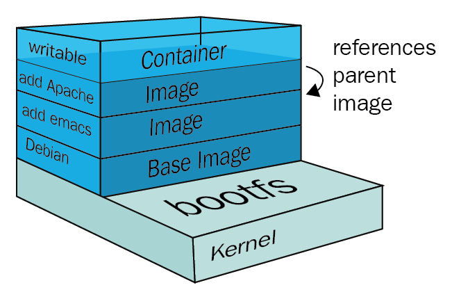
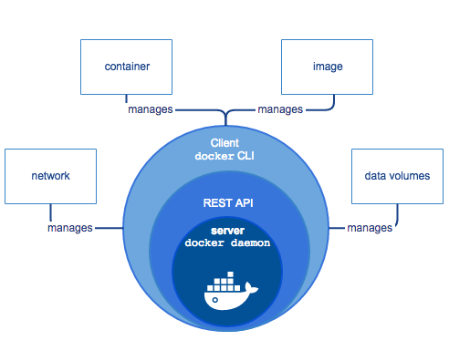

 ## Sumário

- [Conceitos Fundamentais do Docker](#conceitos-fundamentais-do-docker)
- [Containers](#containers)
- [Camadas logicas de um container](#camadas-logicas-de-um-container)
- [Dockerfile](#dockerfile)
- [Docker Registry](#docker-registry)
- [Docker Hub](#docker-hub)
- [Comandos - Docker](#comandos---docker)
- [Volumes](#o-que-são-volumes-no-docker)
- [Networks no Docker](#Networks)
- [Docker Compose](#docker-compose)

## Conceitos Fundamentais do Docker 🐳

O Docker usa um esquema de **camadas (layers)**, e para montar essas camadas são usadas técnicas de **Copy-On-Write**, que evitam duplicação desnecessária de dados ao compartilhar camadas entre containers.
Um **container** é basicamente uma **pilha de camadas** compostas por **N camadas read-only** e **uma camada superior read-write**.

### Definição oficial

Containers Docker empacotam componentes de software em um sistema de arquivos completo, que contêm tudo necessário para a execução: código, runtime, ferramentas de sistema - qualquer coisa que possa ser instalada em um servidor. Isto garante que o software sempre irá executar da mesma forma, independente do seu ambiente.

### Diferenças entre container e VM:

| Característica      | Container                   | Máquina Virtual                     |
|---------------------|-----------------------------|------------------------------------ |
| Isolamento          | Compartilha kernel          | Kernel próprio                      |
| Desempenho          | Leve, inicia em segundos    | Mais pesada, pode demorar minutos   |
| Imagem base         | Menor                       | Maior                               |
| Gerenciamento       | Docker Engine               | Hypervisor (Ex: VirtualBox, VMWare) |

### Containers

Containers são similares às máquinas virtuais, porém **mais leves** e mais **integrados ao sistema operacional da máquina host**. Eles compartilham o **kernel do host**, o que proporciona **melhor desempenho**, graças ao gerenciamento único dos recursos e ao **isolamento das imagens**.

Um container normalmente roda com o máximo de isolamento possível do host, sendo esse isolamento viabilizado pelo Docker Engine e recursos do kernel Linux.
Mas normalmente não queremos um isolamento total, e sim um **isolamento controlado**, em que os recursos que o container terá acesso são explicitamente indicados.

**Principais recursos de controle do isolamento:**

- Mapeamento de portas
- Mapeamento de volumes
- Cópia de arquivos para o container ou a partir do container
- Comunicação entre os containers

**Diferenças entre container e imagem**

Utilizando uma analogia com `POO`, podemos comparar um container a um objeto  (instância), enquanto a imagem seria uma classe (modelo).  
[Docker Registry](https://docs.docker.com/registry/)  
É uma aplicação *server-side* para guardar e distribuir imagens Docker.  
[Docker Hub](https://hub.docker.com/)  

É um serviço de registro de imagens Docker em nuvem, que permite a associação com repositórios para **build automatizado** de imagens. Imagens marcadas como **oficiais** no Docker Hub são criadas pela própria **Docker Inc.**

### Camadas logicas de um container

- Camadas de imagem: Uma imagem de container é composta por uma série de camadas, **onde cada uma representa uma alteração na imagem.**
- Compartilhamento: Essas camadas de imagem são somente para leitura e **podem ser compartilhadas entre vários containers** para otimizar o uso de armazenamento.
- Camada gravável (camada de container): Cada container, como uma instância da imagem, tem uma camada superior, gravável, onde as alterações são feitas sem afetar a imagem base ou outros containers.
- Portabilidade: O sistema de camadas garante que as modificações não são aplicadas ao sistema de arquivos original, tornando o container portátil. 



---
## Comandos docker

### 1. Inspeção Básica  
#### Listar containers  
-   `docker ps` --- Lista containers em execução\  
-   `docker ps -a` --- Lista todos, inclusive parados\  
-   `docker ps -q` --- Lista apenas IDs dos containers  
#### Listar imagens  
-   `docker images` --- Lista imagens locais\  
-   `docker images -q` --- Apenas IDs das imagens  
#### Informações gerais  
-   `docker version` --- Mostra versão instalada\  
-   `docker info` --- Exibe dados do ambiente Docker  
------------------------------------------------------------------------

### 2. Gerenciamento de Imagens  
#### Download de imagens  
-   `docker pull nginx` --- Baixa imagem\  
-   `docker pull ubuntu:20.04` --- Baixa imagem com tag específica  
#### Remover imagens  
-   `docker rmi <imagem>` --- Remove imagem\  
-   `docker rmi -f <imagem>` --- Força remoção  
#### Criar imagens  
-   `docker build -t meu-app .` --- Cria imagem com tag\  
-   `docker build -f Dockerfile.prod -t app-prod .` --- Usa Dockerfile  
    específico  
------------------------------------------------------------------------

### 3. Criando e Executando Containers  
#### Modo interativo  
-   `docker run -it ubuntu bash` --- Abre terminal dentro do container  
#### Background (daemon)  
-   `docker run -d nginx` --- Executa em segundo plano\  
-   `docker run -d -p 8080:80 nginx` --- Mapeamento de portas  
#### Execução com limpeza automática  
-   `docker run --rm ubuntu ls /` --- Remove container ao final  
#### Criar sem iniciar  
-   `docker create --name teste nginx`  
------------------------------------------------------------------------

### 4. Acessando Containers  
#### Executar comando dentro do container  
-   `docker exec -it <container> bash`\  
-   `docker exec -it <container> sh` --- Caso não exista bash  
#### Anexar ao terminal  
-   `docker attach <container>`  
#### Sair sem encerrar container  
-   `Ctrl + P` + `Ctrl + Q`  
------------------------------------------------------------------------

### 5. Ciclo de Vida do Container  
#### Parar, iniciar e reiniciar  
-   `docker stop <container>`\  
-   `docker start <container>`\  
-   `docker restart <container>`  
#### Remover containers  
-   `docker rm <container>` --- Container parado\  
-   `docker rm -f <container>` --- Remove mesmo ativo  
#### Renomear  
-   `docker rename antigo novo`  
------------------------------------------------------------------------

### 6. Monitoramento e Logs  
#### Logs  
-   `docker logs <container>`\  
-   `docker logs -f <container>` --- Seguir logs  
#### Processos dentro do container  
-   `docker top <container>`  
#### Inspecionar container  
-   `docker inspect <container>`\  
-   `docker inspect <imagem>`  
#### Uso de recursos  
-   `docker stats` --- CPU, memória, rede\  
-   `docker stats <container>` --- Específico  
------------------------------------------------------------------------

### 7. Controle de Recursos  
#### Limitar memória e CPU  
-   `docker run -m 256M nginx` --- Limite memória\  
-   `docker run --cpus=0.5 nginx` --- 50% de um núcleo\  
-   `docker run -d -m 128M --cpus 0.5 nginx`  
------------------------------------------------------------------------

### 8. Volumes e Persistência  
#### Criar volumes  
-   `docker volume create dados`  
#### Listar volumes  
-   `docker volume ls`  
#### Inspecionar volume  
-   `docker volume inspect dados`  
#### Montar volume no container  
-   `docker run -v dados:/var/lib/mysql mysql`  
#### Remover volume  
-   `docker volume rm dados`  
------------------------------------------------------------------------

### 9. Redes no Docker  
#### Criar rede  
-   `docker network create minha-rede`  
#### Listar redes  
-   `docker network ls`  
#### Inspecionar rede  
-   `docker network inspect minha-rede`  
#### Rodar container em rede específica  
-   `docker run -d --network minha-rede nginx`  
#### Conectar / desconectar container da rede  
-   `docker network connect minha-rede meu-container`\  
-   `docker network disconnect minha-rede meu-container`  
------------------------------------------------------------------------

### 10. Docker System (Manutenção)  
#### Limpeza completa  
-   `docker system prune` --- Limpa containers/parados\  
-   `docker system prune -a` --- Limpa tudo, incl. imagens\  
-   `docker system prune --volumes -a -f` --- Limpa volumes também  
#### Limpeza específica  
-   `docker container prune`\  
-   `docker image prune`\  
-   `docker volume prune`\  
-   `docker network prune`  

#### Comando para limpar volumes, images e containers parados  
- `sudo docker system prune --all -f --volumes`
------------------------------------------------------------------------

### 11. Login em Registries  
-   `docker login` --- Realiza login no Docker Hub\  
-   `docker logout` --- Encerra sessão\  
-   `docker tag meu-app usuario/meu-app:v1` --- Marca imagem\  
-   `docker push usuario/meu-app:v1` --- Envia ao registry  
------------------------------------------------------------------------

### 12. Ajuda  
-   `docker <comando> --help`\  
-   `docker help`  
------------------------------------------------------------------------

### 13. Comandos Rápidos (Cheatsheet)  
    docker pull nginx  
    docker run -d -p 8080:80 --name web nginx  
    docker exec -it web bash  
    docker logs -f web  
    docker stop web  
    docker rm web  
    docker system prune -a -f --volumes  
------------------------------------------------------------------------

##### Copiar arquivos
- Do host para o container: `docker cp arquivo.txt meu-container:/home/` 
- Do container para o host: `docker cp meu-container:/home/arquivo.txt .`


**Exemplos:**
`sudo docker container run -d -m 128M --cpus 0.5 nginx`
   → Criação de um container em segundo plano, `-d`
   → `-m 128M`: limita a quantidade máxima de memória
   → `--cpus 0.5`: limita o uso máximo do cpu para meio núcleo (50%)

 `docker run -d -p 80:80 nginx`
   → `docker run`: Cria e inicia um novo container
   → `-d`: significa *detached mode (modo destacado)*, isso faz com que o container rode em segundo plano.
   → `-p 80:80`: mapeamento de portas
   → `nginx`: nome da imagem

`docker container run -ti --mount type=bind,source=/home/mateus/giropops,target=/giropops debian`   
   → `-ti`: abre o terminal interativo  
   → `--mount`: monta diretório do host no container  
   → `type=bind`: tipo de montagem  
   → `source=/home/mateus/giropops`: caminho do host  
   → `target=/giropops`: onde aparecerá dentro do container

   O `--mount` no Docker serve para ligar um diretório (ou volume) do host ao contêiner, permitindo que os dados sejam compartilhados entre o sistema do host e o contêiner. Isso é essencial para persistência de dados


   ##### 🔍 Tipos de `mount`

   `docker run --mount type=<tipo>,source=<origem>,target=<destino> <imagem>`

   | Tipo          | Descrição                                                               |   
   |---------------|-------------------------------------------------------------------------|
   | `bind`        | Liga um caminho real do host a um diretório no contêiner.               |
   | `volume`      | Usa um volume Docker (gerenciado automaticamente).                      |
   | `tmpfs`       | Cria um sistema de arquivos temporário (RAM), útil para dados voláteis. |


---



## 📁 Imagens

Imagens *são originadas de arquivos que programamos* para que o Docker crie uma estrutura que execute determinadas ações em containers.

```
Ao rodar um container baseado na imagem, as instruções serão executadas em camadas.
```

O comando `docker build` é responsável por ler um Dockerfile e produzir uma nova imagem Docker.

> 📄 [Documentação do Dockerfile](https://docs.docker.com/engine/reference/builder)

1. `docker images`  
   → Lista todas as imagens Docker disponíveis localmente.

2. `docker build -t minha-imagem .`  
   → Cria uma imagem chamada `minha-imagem` com base no `Dockerfile` da pasta atual.

3. `docker rmi <nome-ou-id>`  
   → Remove uma imagem Docker.

4. `docker image inspect <nome-imagem>`  
   → Ver detalhes da imagem
5. `docker tag httpd:2.4 meuusuario/apache-custom:meu-projeto`
   → `docker tag`: comando usado para renomear (retag) uma image
   → `httpd:2.4`: nome da imagem original que foi baixada
   → `meuusuario/apache-custom:meu-projeto`: novo nome (com namespace) e tag que eu irei dar a imagem.

#### Dockerfile

> Nome *default* para o arquivo com instruções para o **build** de imagens Docker.

### Exemplos básicos de Dockerfiles

```Dockerfile
# Imagem base
FROM python:3.11
# Define diretório de trabalho
WORKDIR /app
# Copia os arquivos da aplicação
COPY . .
# Instala dependências
RUN pip install -r requirements.txt
# Comando padrão ao iniciar container
CMD ["python", "app.py"]
```

```Dockerfile
FROM node:20
WORKDIR /app
COPY . .
RUN npm install
CMD ["npm", "start"]
```

**Principais comandos:**

| Comando      | Descrição                                               |
|--------------|---------------------------------------------------------|
| `FROM`       | Define a imagem base do container.                      |
| `COPY`       | Copia um arquivo do filesystem local para o container.  |
| `RUN`        | Executa um ou mais comandos no container.               |
| `WORKDIR`    | Define o diretório de execução atual.                |
| `USER`       | Define o usuário que irá executar os processos do container. |
| `ENTRYPOINT` | Define o processo principal do container.               |

**CMD**
Define o comando padrão ou parâmetros padrão que serão executados se nenhum comando for passado quando o container for iniciado.
**ENTRYPOINT**
Define o comando fixo (o ponto de entrada) que sempre será executado quando o container rodar.

```
ENTRYPOINT ["ping"]
CMD ["google.com"]
```
```
FROM ubuntu
ENTRYPOINT ["top", "-b"]
CMD ["-c"]
```

#### Renomeação de uma imagem Docker

No Docker, renomear uma imagem significa dar a ela um novo nome (tag), sem modificar seu conteúdo. Isso é útil para:
 - Organizar suas imagens localmente;
 - Subir para registries com nomes específicos;
 - Versão de imagens;
 - Trocar o repositório/namespace;

 `docker tag <imagem_original> <novo_nome>`
 
--- 

### 📦 O que são Volumes no Docker?

Volumes são a forma recomendada pelo Docker para armazenar dados persistentes. Eles são armazenados fora do sistema de arquivos interno do contêiner e **não são apagados quando o contêiner é removido.**

### Por que usar Volumes?

- Persistência de dados entre execuções do contêiner
- Separação de dados e aplicação
- Permite que múltiplos contêineres compartilhem os mesmos dados
- Evita perda de dados ao remover ou atualizar contêineres
- Permite backup/restauração com facilidade

### Tipos de montagem

| Tipo           | Exemplo                          | Descrição                               |
| -------------- | -------------------------------- | --------------------------------------- |
| **Volume**     | `-v volume-nome:/app/dados`      | Armazenamento gerenciado pelo Docker    |
| **Bind Mount** | `-v /caminho/no/host:/app/dados` | Usa um caminho fixo do host             |
| **Tmpfs**      | `--tmpfs /app/dados`             | Armazenamento temporário na RAM (Linux) |

### ✅ Comandos principais

1. `docker volume create meu-volume`  
   → Criar um volume

2. `docker volume ls`  
   → Listar volumes

3. `docker volume inspect <meu-volume>`  
   → Inspecionar volume

4. `docker run -d -v meu-volume:/dados ubuntu`  
   → Usar um volume ao rodar um contêiner

5. `docker volume rm meu-volume`  
   → Remover um volume

6. `docker volume prune`  
   → Apagar todos os volumes não utilizados

7. `docker run -v volume:/data:ro`
   → Criação de um volume que tem apenas permissão de leitura.
   → `:ro` : é a abreviação de only
---

## Networks no Docker

 - Uma forma de gerenciar a conexão com Docker com outras plataformas ou até mesmo entre containers
 - As redes ou networks são criadas separadas do containers, como os volumes

Os container costuma ter três principais tipos de comunicação:

| Tipo                 | Descrição                               |
| -------------------- | --------------------------------------- |
| **Externa**          | Conexão com uma API de um servidor remoto |
| **Com o host**       | Conexão com uma máquina que está executando o docker |
| **Entre containers** | Comunicação que utiliza o driver bridge e permite a comunicação entre dois containers |

Tipos de rede (drivers):

|  Rede  |  Descrição  | 
|--------|-------------|
| **Bridge**  | o mais comum e default do Docker, utilizado quando containers precisam se conectar|
| **host**    | permite a conexão entre um container a máquina que está hosteando o Docker|
| **macvian** | permite a conexão a um container por um MAC address|
| **none**    | remove todas conexões de rede de um container|
| **plugins** | permite extensões de terceiros para criar outras redes|

Comandos

1. `docker netword ls`
   → Listar todas as redes do docker
2. `network create <nome-da-rede>`
   → Comando para criar uma rede
   > `docker network create -d macvlan meu_macvlan`
   `-d` determina o tipo de rede
3. `docker network rm <nome-da-rede>`
   → Remove a rede indicada.
4. `docker network inspect minha_red`
   → Inspeciona a rede.
5. `docker network connect minha_rede meu_container`
   → Conectar container a uma rede
6. `Desconectar container de uma rede`
   → docker network disconnect minha_rede meu_container
---
## Docker Compose

Docker Compose permite definir e executar multi-containers com um único arquivo YAML (`docker-compose.yml`).

- Com o Docker Compose, teremos apenas um arquivo de configuração, que orquestra todos os contêiners
- É uma forma de rodar múltiplos builds e runs com um comando
- O arquivo chamado docker-compose.yml deve ser criado na raiz do projeto. Este arquivo irá cordenar os containers e imagens.
   - **version**: versão do Compose;
   - **services**: Containers/serviços que vão rodar essa configuração.
   - **Volumes**: Possível adição de volumes.

O compose funciona em todos os ambientes: produção, preparação, desenvolvimento, teste e fluxos de trabado de CI. Ele também possui comandos para gerenciar todo o ciclo de vida do se aplicativo: 
- Iniciar, parar e reconstruir serviços
- Ver o status dos serviços em execução
- Transmita a saída de log dos serviços em execução
- Execute um comando único em um serviço

#### Definição de serviços no Docker Compose

Um serviço é uma definição abstrata de um recurso computacional dentro de uma aplicação que pode ser dimensionado ou substituído independentemente de outros componentes. Os serviços são suportados por um conjunto de contêineres, executados pela plataforma de acordo com os requisitos de replicação e restrições de posicionamento. Como os serviços são suportados por contêineres, eles são definidos por uma imagem Docker e um conjunto de argumentos de tempo de execução. Todos os contêineres dentro de um serviço são criados de forma idêntica com esses argumentos.


**Exemplo** e arquivo de configuração que inicializa dois containers usando Docker, MySql e WordPress, além de criar um arquivo persistente para salvar os dados do MySql.

```
version: "3.8"  # Versão da sintaxe do docker-compose (boa prática definir)

services:       # Define os serviços (containers) do projeto
   db:          # Nome do serviço (container) do banco MySQL
      image: mysql:5.7              # Imagem oficial do MySQL versão 5.7
      volumes:                      # Volumes persistentes
         - db_data:/var/lib/mysql   # Mapeia o volume "db_data" para armazenar dados do MySQL
      restart: always               # Sempre reinicia o container em caso de falha ou reboot
      environment:                  # Variáveis de ambiente do MySQL
         MYSQL_ROOT_PASSWORD: 1234  # Senha do usuário root
         MYSQL_DATABASE: WordPress  # Cria o banco de dados "WordPress" automaticamente
         MYSQL_USER: Mateus         # Cria o usuário "Mateus"
         MYSQL_PASSWORD: 1234       # Senha do usuário "Mateus"

   wordpress:                       # Nome do serviço (container) do WordPress
      depends_on:                   # Garante que o serviço "db" suba primeiro
         - db
      image: wordpress:latest       # Imagem oficial do WordPress na versão mais recente
      ports:                        # Mapeamento de portas
         - "8080:80"                # Porta 8080 do host → porta 80 do container
      restart: always               # Sempre reinicia em caso de falha
      environment:                  # Variáveis de ambiente do WordPress
         WORDPRESS_DB_HOST: db:3306 # Endereço do banco (nome do serviço "db" + porta 3306)
         WORDPRESS_DB_USER: Mateus  # Usuário do banco (precisa ser o mesmo definido no MySQL)
         WORDPRESS_DB_PASSWORD: 1234 # Senha do banco (mesma definida no MySQL)
         WORDPRESS_DB_NAME: WordPress # Nome do banco (mesmo definido no MySQL)

volumes:            # Define volumes persistentes
   db_data: {}      # Volume chamado "db_data" (armazenará os dados do MySQL)

```

Verificando o que tem no Compose

Podemos fazer a verificação do compose com o comando: `docker-compose ps`. Receberemos um resumo dos serviços que sobem ao rodar o compose, facilitando a leitura do projeto.

> Não precisa obrigatoriamente de um Dockerfile para usar o Docker Compose.

#### Comandos Essenciais do Docker Compose

**1. Iniciar o Ambiente (Build, Criação e Execução)**
| Comando   | Descrição|
| ------------------- | ------------------ |
| `docker compose up`| Inicia todos os serviços definidos no arquivo Compose em primeiro plano (você verá os logs na tela). Se as imagens não existirem, ele as baixa ou constrói (se houver a instrução build). |
| `docker compose up -d` | Recomendado para uso geral. Inicia todos os serviços em modo detached (segundo plano), liberando seu terminal.                                                                            |
| `docker compose build` | Constrói ou reconstrói as imagens para os serviços que contêm a instrução build no arquivo Compose (útil para atualizar o código da sua aplicação antes de subir os containers).          |

**2. Gerenciamento e Monitoramento**
| Comando| Descrição|
| --------------------------------- | -------------------------- |
| `docker compose ps `                      | Lista os containers (serviços) definidos no Compose que estão rodando e mostra seu status. |
| `docker compose logs [serviço]`          | Exibe os logs de um serviço específico (por exemplo, docker compose logs wordpress).       |
| `docker compose top`                      | Exibe os processos em execução dentro dos containers.                                      |
| `docker compose exec [serviço] [comando]` | Executa um comando dentro de um container em execução. Útil para depuração.                |

**3. Parar e Limpar**
| Comando| Descrição|
| --------------------- | ------------ |
| `docker compose stop`          | Para os containers em execução, mas não os remove. Eles podem ser reiniciados rapidamente com docker compose start.|
| `docker compose start`          | Inicia containers que foram previamente parados.|
| `docker compose down`          | Para e remove os containers, redes e volumes definidos pelo Compose.|
| `docker compose down --volumes` | Limpeza Completa. Para e remove containers, redes e os volumes persistentes (como o db_data do seu exemplo). Use com cautela, pois isso apaga seus dados. |


#### Utilização do Dockerfile e do Docker-compose

Se a imagem a ser rodada já estiver pronta no **Docker Hub** basta referenciar a imagem no `docker-compose.yaml`
Será necessário a construção de um arquivo **Dockerfile** se:
- Quer personalizar uma imagem (ex.: instalar libs adicionais, copiar código, alterar configuração).
- Vai rodar um aplicativo próprio (ex.: API em Node, Flask, Java, etc.) que ainda não tem imagem publicada no Docker Hub.
#### Arquivo Compose

O caminho padrão para um arquivo do Compose é compose.yaml (preferencialmente) ou compose.yml que esteja localizado no diretório de trabalho. O Compose também suporta docker-compose.yaml e docker-compose.yml para compatibilidade com versões anteriores. Se ambos os arquivos existirem, o Compose prefere o arquivo compose.yaml.