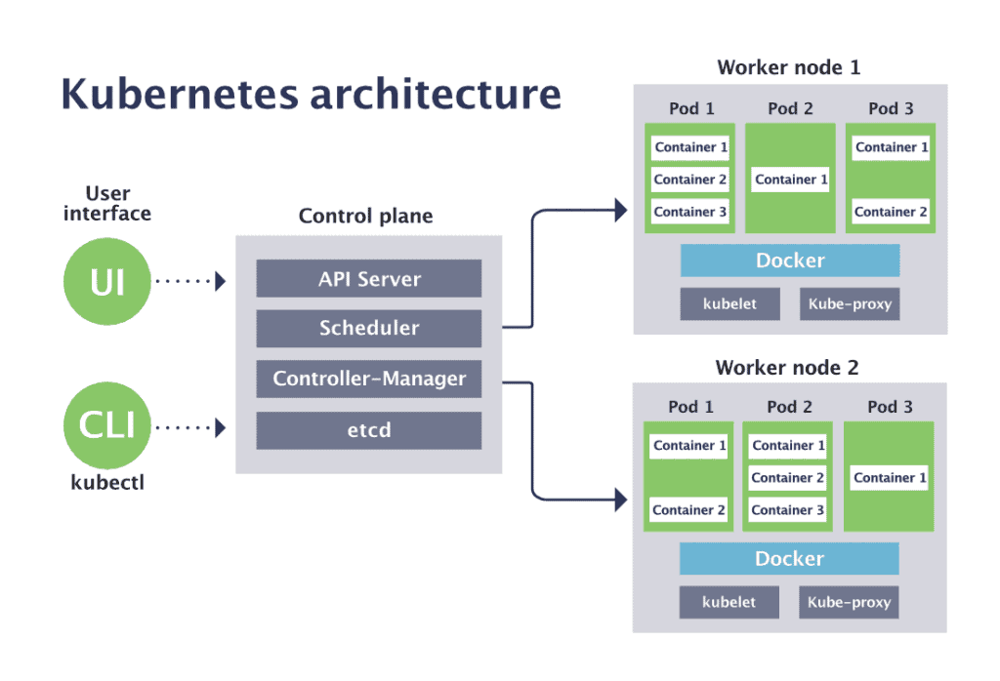
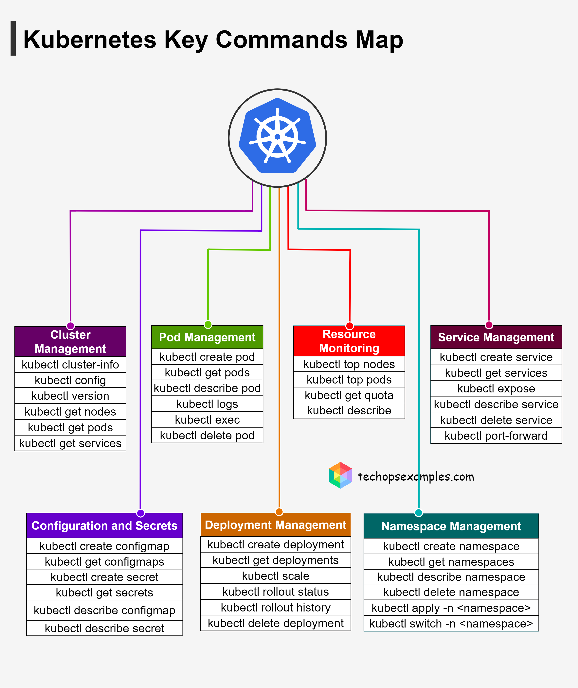

# Conceitos de Orquestração 🎭📦

Orquestradores de Containers são responsáveis pela implementação, monitoramento e controle de containers em ambientes de múltiplos servidores. Eles são essenciais para ambientes empresariais de hospedagem de aplicações.

Hoje existem diversos Orquestradores de Containers disponíveis tanto na nuvem quanto para instalações on-premises, ou locais. Entre os principais estão: Kubernetes, Docker Swarm, Openshift e Mesos.

No caso dos Orquestradores de Containers, um projeto é em geral definido de maneira declarativa e é chamado de Estado do Cluster. Basicamente nós decidimos qual é o estado desejado do ambiente e o Orquestrador irá monitorar todo o ambiente fazendo modificações para alcançar o estado desejado.

## Kubernetes 🌐​



O Orquestrador de Containers mais utilizado no mercado atualmente é o Kubernetes. Kubernetes (K8s) é um produto Open Source utilizado para automatizar a implantação, o dimensionamento e o gerenciamento de aplicativos em contêiner.

[Documentação Oficial do Kubernetes](https://kubernetes.io/pt-br/docs/home/)

## O Container Engine

  Antes de começar a falar um pouco mais sobre o Kubernetes, nós primeiro precisamos entender
alguns componentes que são importantes no ecossistema do Kubernetes, um desses componentes
é o Container Engine.
  O Container Engine é o responsável por gerenciar as imagens e volumes, ele é o responsável
por garantir que os os recursos utilizados pelos containers estão devidamente isolados, a
vida do container, storage, rede, etc.
  Até pouco tempo atrás tinhamos somente o Docker para esse papel. Mas hoje já temos diversas
opções para se utilizar como Container Engine.
  Opções como o Docker, o CRI-O e o Podman são bem conhecidas e preparadas para o ambiente 
produtivo. O Docker, é o Container Engine mais popular e ele utiliza como Container Runtime o containerd.

#### OCI - Open Container Initiative

A OCI é uma organização sem fins lucrativos que tem como objetivo padronizar a criação de containers, para que possam ser executados em qualquer ambiente. A OCI foi fundada em 2015 pela Docker, CoreOS, Google, IBM, Microsoft, Red Hat e VMware e hoje faz parte da Linux Foundation.

O runc, principal projeto desenvolvido pela OCI, é um container runtime de baixo nível amplamente utilizado por diversos Container Engines, incluindo o Docker. Este projeto, totalmente open source, é escrito em Go e seu código fonte pode ser acessado no GitHub.

Agora sim já podemos falar sobre o que é o Container Runtime.

#### O Container Runtime

Para que seja possível executar os containers nos nós é necessário ter um *Container Runtime* instalado em cada um desses nós.

O *Container Runtime* é o responsável por executar os containers nos nós. Quando você está utilizando ferramentas como Docker ou Podman para executar containers em sua máquina, por exemplo, você está fazendo uso de algum *Container Runtime*, ou melhor, o seu Container Engine está fazendo uso de algum *Container Runtime*.

Temos três tipos de *Container Runtime*:

- Low-level: são os *Container Runtime* que são executados diretamente pelo Kernel, como o runc, o crun e o runsc.

- High-level: são os *Container Runtime* que são executados por um *Container Engine*, como o containerd, o CRI-O e o Podman.

- Sandbox e Virtualized: são os *Container Runtime* que são executados por um *Container Engine* e que são responsáveis por executar containers de forma segura. O tipo Sandbox é executado em unikernels ou utilizando algum proxy para fazer a comunicação com o Kernel. O gVisor é um exemplo de *Container Runtime* do tipo Sandbox. Já o tipo Virtualized é executado em máquinas virtuais. A performance aqui é um pouco menor do que quando executado nativamente. O Kata Containers é um exemplo de *Container Runtime* do tipo Virtualized.

#### Diferenças entre **Control Plane** e **Workers**

 O Control Place é o cérebro, responsável por gerenciar o estado desejado. Ele decide o que o cluster deve rodar, monitor e corrigir desvios.
  O Workeres (Nós de trabalho), são os nós onde suas aplicações relmente rodam. ele escuta os Pods (containers da sua aplicação).

|Aspector | Control Place | Workers |
|---------|---------------|---------|
| Função| Gerenciar o cluster | Executar aplicações (Pods) |
| Responsabilidade| Decisões, agendamento, estado do cluster | Rodar containers e serviços |
| Componentes| API Server, etcd, Scheduler, Controller Manager | Kubelet, Kube Proxy, Runtime |
| Onde roda apps?| Não (salvo exceções em clusters pequenos, ex. minikube) | Sim, aqui ficam os Pods do usuário |


## Principais Conceitos 💻​


### Cluster

Conjunto de máquinas (físicas ou virtuais) que trabalham juntas para executar aplicações em containers. Um cluster Kubernetes contém pelo menos:

- Um **control plane** (plano de controle)
- Um ou mais **nodes** (nós) onde os aplicativos são executados

---

### Node

É uma máquina (física ou virtual) dentro do cluster responsável por executar os **pods**. Existem dois tipos:

- **Master node** (controla o cluster)
- **Worker node** (executa os aplicativos)

---

### Pod

A menor unidade implantável no Kubernetes. Um **pod** pode conter um ou mais containers que compartilham:

- A mesma rede/IP
- Armazenamentos
- Ciclo de vida

---

### Componentes

O Kubernetes é formado por uma série de componentes que compartilham um mesmo estado em um banco dedados do tipo Chave-Valor, o ETCD. A interação entre esses diversos componentes gerenciam um cluster que pode ser formado por centenas ou até mesmo milhares de containers e servidores. Podemos dividir esses componentes em 3 camadas: Os componentes do Control Plane, os componentes do Node Plane e os Addons.

 - O Control Plane é responsável pelas decisões administrativas do ambiente. Pense nele como a cabeça por trás das decisões tomadas pelo Kubernetes.
 - No Node Plane são reunidos os componentes que são executados em todos os servidores do Cluster. Nele temos os componentes que gerenciam os container e rede dos servidores. 
 - Por fim, os Addons são componentes que usam recursos do Kubernetes para adicionar capacidades extras ao Cluster.


##### Kube-apiserver
```
  O Kube-apiserver é o componente que dá acesso ao Control Plane e é a 
  porta de entrada do cluster. Todo acesso ao cluster é mediado por esta 
  API. Quando executamos um comando através do executável kubectl, 
  estamos fazendo uma chamada a API do Kubernetes, que está sendo mantida 
  pelo kube-apiserver.
```
##### ETCD
```
  Todos os dados do Kubernetes são mantidos no ETCD, que é um banco de dados
  do tipo chave-valor baseado em consenso. Nele o Estado do Cluster é 
  mantido e por isso o ETCD prioriza a consistência dos dados sobre 
  disponibilidade.

  E possível manter árias réplicas do ETCD ativas ao mesmo tempo, e mesmo a 
  falha de uma delas não afetará a disponibilidade do ambiente e integridade 
  dos dados do Kubernetes.
```

##### Kube-scheduler 
```
    O Kube-scheduler é o responsável por determinar em que servidor cada 
    pod será iniciado e executado. Para tomar esta decisão ele leva em 
    conta diversas questões, como disponibilidade de recursos, políticas 
    aplicadas às cargas de trabalho e atribuições especiais 
    vindas do usuário.
 ```

##### Kube controller manager
```
  O Kube-controller-manager é responsável por gerir as tarefas 
  administrativas do cluster. Nele, diversos Controladores com diversas 
  responsabilidades distintas são executados a fim de manter o estado do 
  cluster atualizado.
```
##### Kubelet
 ```
    O Kubelet é o processo responsável por iniciar os containers definidos 
    nos pods. Ele conversa com o Container Runtime instalado no servidor 
    garantindo a execução e a saúde dos containers definidos no Estado do 
    Cluster.
 ```

### Services 

Um dos principais objetivos dos Serviços no Kubernetes é que você não precisa modificar sua aplicação existente para usar um mecanismo de descoberta de serviços desconhecido. Você pode executar código em Pods, seja um código desenvolvido para um ambiente nativo da nuvem ou uma aplicação mais antiga que você conteinerizou. Você usa um Serviço para **disponibilizar esse conjunto de Pods na rede**, permitindo que os clientes interajam com ele.

**ClusterIP**
Expõe o serviço em um IP interno do cluster. Escolher esse valor torna o serviço acessível apenas de dentro do cluster. Esse é o valor padrão usado se você não especificar explicitamente um IP para o serviço. Você pode expor o serviço à internet pública usando um Ingress ou um Gateway .
**NodePort**
Expõe o serviço no IP de cada nó em uma porta estática (a NodePort). Para disponibilizar a porta do nó, o Kubernetes configura um endereço IP de cluster, da mesma forma que se você tivesse solicitado um serviço de type: ClusterIP.
**LoadBalancer**
Expõe o serviço externamente usando um balanceador de carga externo. O Kubernetes não oferece um componente de balanceamento de carga diretamente; você precisa fornecer um ou pode integrar seu cluster Kubernetes a um provedor de nuvem.
**ExternalName**
Mapeia o serviço para o conteúdo do externalNamecampo (por exemplo, para o nome do host api.foo.bar.example). O mapeamento configura o servidor DNS do seu cluster para retornar um CNAME registro com esse valor de nome de host externo. Nenhum tipo de proxy é configurado.

> Comando para pegar a porta do serviço:
` kubectl get svc <nome-service> -o yaml | grep address`

> Lista todos os serviços no namespace atual.
`kubectl get services (ou kubectl get svc)`

> Mostra detalhes completos de um serviço específico, incluindo seletores, endpoints e portas.
`kubectl describe service <nome-do-serviço>`

> Cria um serviço para expor um deployment, pod ou outro recurso.
`kubectl expose <tipo-recurso> <nome> --port=<porta> --target-port=<porta>`

> Remove um serviço do cluster.
`kubectl delete service <nome-do-serviço>`

> Lista os endpoints (IP dos pods) aos quais o serviço está direcionando.
`kubectl get endpoints <nome-do-serviço>`

> Edita o serviço diretamente no editor de texto.
`kubectl edit service <nome-do-serviço>`

> Faz redirecionamento de porta de um serviço para acesso local.
`kubectl port-forward service/<nome-do-serviço> <porta-local>:<porta-serviço>`

> Altera o tipo do serviço, por exemplo, para NodePort.
`kubectl patch service <nome-do-serviço> -p '{"spec":{"type":"NodePort"}}'`

### Endpoints Controller 📈​

O Endpoint Controller é responsável por adicionar Endpoints, ou IP’s de Pods, a lista de Endpoint de um Service. Ele observa as regras definidas no campo Selector de um Service para descobrir que Pods devem ser adicionados a lista, tornando possével a descoberta de Serviço de forma fácil e prática usando DNS e Services.


Endpoints no Kubernetes funcionam como um mapa de endereços IP e portas dos pods que pertencem a um serviço, sendo criados automaticamente quando um serviço é criado.


```yaml
apiVersion: v1     # Versão da API Kubernetes usada para este recurso
kind: Endpoints   # Tipo do recurso: Endpoints, que define IPs backend manualmente
metadata:
  name: my-endpoints-service     # Nome do recurso Endpoints (deve ser o mesmo do Service associado)
subsets:   # Lista de subsets, definindo grupos de endpoints
  - addresses:
      - ip: 77.68.88.76  # IP do backend (aqui um servidor IIS)
#     - ip: 10.244.0.9   # IP comentado (exemplo de outro backend Apache)
#     - ip: 10.244.0.10  # IP comentado (exemplo de backend Nginx)
    ports:
      - port: 80   # Porta em que o backend está escutando (porta 80)

---

apiVersion: v1     # Versão da API Kubernetes usada para este recurso
kind: Service     # Tipo do recurso: Service, que expõe rede para acesso
metadata:
  name: my-endpoints-service   # Nome do serviço (deve ter mesmo nome do Endpoints para linkar)
spec:
  ports:
    - protocol: TCP     # Protocolo TCP para acesso ao serviço
      port: 80         # Porta exposta pelo serviço no cluster
      targetPort: 80   # Porta no backend para qual o tráfego será direcionado

```

##### EndPointSlice
A API EndpointSlice é o mecanismo que o Kubernetes usa para permitir que seu serviço seja dimensionado para lidar com um grande número de backends e permite que o cluster atualize sua lista de backends íntegros de forma eficiente.


##### YAML Kubernetes Example

```yaml

apiVersion: v1
# Indica o tipo do objeto que está sendo criado, neste caso um Pod, que é a menor unidade de implantação que pode conter um ou mais contêineres.
kind: Pod 
# Define metadados do Pod. name é o nome do Pod que será criado como "rss-site". labels são pares chave-valor que categorizam o Pod
metadata:
  name: rss-site
  labels:
    app: web
# Define a especificação do Pod, ou seja, o que ele deve conter e como ele deve se comportar.
spec:
  containers:
    - name: front-end
      image: nginx-container
      ports:
        - containerPort: 80
    - name: redis-container
      image: redis:5.0.4
      ports:
        - containerPort: 6379

```

### Volume
Volumes fornecem armazenamento persistente para os pods. Eles mantêm dados mesmo se o pod for recriado
Tipos comuns de volumes:
 - emptyDir
 - hostPath
 - persistentVolumeClaim (PVC)

### Namespace
Permite organizar e isolar recursos dentro de um mesmo cluster. Muito útil em ambientes com múltiplos times ou projetos.
Exemplo: `kubectl create namespace meu-projeto`

### Objetos do Kubernetes
Os objetos principais do Kubernetes representam recursos persistentes que definem o estado desejado do cluster e das aplicações que nele rodam. Entre os mais importantes estão:
- Deployment: Gerencia a implantação e o ciclo de vida de um conjunto de réplicas de pods. Garante o número desejado de réplicas, possibilita atualizações e rollback de versões da aplicação, facilitando escalabilidade e alta disponibilidade.

Exemplo de definição:
```yaml
apiVersion: apps/v1         # Define a versão da API do Kubernetes que será usada para esse recurso (aqui: apps/v1, usado para Deployments).
kind: Deployment            # Indica o tipo de recurso que está sendo criado, neste caso um Deployment.
metadata:
  name: meu-app             # Nome do Deployment, que serve como identificador dentro do cluster.
spec:
  replicas: 3               # Quantidade de réplicas (pods) que o Deployment deve manter em execução.
  selector:                 # Define como o Deployment vai identificar quais Pods pertencem a ele.
    matchLabels:            # Critério de correspondência: procura Pods com o rótulo abaixo.
      app: meu-app          # Rótulo usado para identificar os Pods que fazem parte deste Deployment.
  template:                 # Template que descreve como os Pods desse Deployment devem ser criados.
    metadata:
      labels:
        app: meu-app        # Rótulo que será adicionado aos Pods criados (precisa bater com o selector acima).
    spec:
      containers:           # Lista de containers que irão rodar dentro de cada Pod.
        - name: nginx       # Nome do container (apenas identificador dentro do Pod).
          image: nginx      # Imagem Docker que será usada para criar o container (nesse caso, a imagem oficial do Nginx do Docker Hub).
          ports:
            - containerPort: 80  # Porta exposta pelo container (nesse caso, o Nginx escuta na porta 80).

```

- DaemonSet: Garante que uma cópia de um pod específico seja executada em todos (ou em nós selecionados) do cluster. Muito usado para tarefas como coleta de logs ou monitoramento que precisam rodar em cada nó.
``` bash
kubectl get daemonset # lista os DaemonSets presentes no cluster e mostra status básico.
kubectl describe daemonset <nome> # mostra detalhes completos e eventos relacionados ao DaemonSet especificado.
kubectl apply -f <arquivo.yaml> # cria ou atualiza um DaemonSet a partir de um arquivo de configuração YAML.
kubectl create -f <arquivo.yaml> # cria um DaemonSet a partir do YAML.
kubectl delete daemonset <nome> # exclui o DaemonSet especificado.
kubectl edit daemonset <nome> # abre o DaemonSet para edição direta no editor de texto.
kubectl rollout status daemonset/<nome> # mostra o status da atualização de rollout do DaemonSet.
kubectl label nodes <nome-do-no> <rótulo> # adiciona rótulos a nós para limitar onde o DaemonSet será executado, usando seletores de nó.
```
- ReplicaSet é o controlador de nível intermediário que mantém a quantidade desejada de pods idênticos sempre ativos no cluster Kubernetes.
- Job: Cria pods que executam tarefas únicas ou batch, garantindo que elas sejam concluídas com sucesso uma vez. Finaliza após a conclusão da tarefa.
```bash
kubectl create job <nome> --image=<imagem> # cria um Job rapidamente usando a imagem especificada.
kubectl apply -f <arquivo.yaml> # cria ou atualiza um Job a partir de um arquivo YAML.
kubectl get jobs # lista todos os Jobs no namespace atual.
kubectl describe job <nome> # exibe detalhes completos de um Job específico, incluindo status e eventos.
kubectl delete job <nome> # deleta um Job específico.
kubectl logs job/<nome> # exibe os logs dos Pods associados ao Job.
kubectl get pods --selector=job-name=<nome> # lista os Pods criados por um Job.
kubectl rollout status job/<nome> # acompanha o status de rollout (geralmente para Jobs controlados por controllers).
```
- CronJob: Permite agendar Jobs para execução periódica, similar a um cron do Linux. Ideal para tarefas como backups, atualizações ou verificações programadas.

```yaml

apiVersion: batch/v1   # [translate:O código YAML que você apresentou define um recurso Kubernetes CronJob, que agenda a execução periódica de Jobs (tarefas) no cluster. Explicando cada parte:]
kind: CronJob    # apiVersion: batch/v1 e kind: CronJob indicam que é um recurso do tipo CronJob na API batch/v1.
metadata: # metadata.name: my-cj define o nome do CronJob.
  name: my-cj
spec:
  failedJobsHistoryLimit: 5    # spec.failedJobsHistoryLimit: 5 mantém o histórico dos últimos 5 Jobs que falharam.
  successfulJobsHistoryLimit: 10    # spec.successfulJobsHistoryLimit: 10 mantém o histórico dos últimos 10 Jobs que foram bem-sucedidos.
  schedule: "* * * * *"   # spec.schedule: "* * * * *" indica que o Job será disparado a cada minuto, no formato cron (minuto, hora, dia do mês, mês, dia da semana).
  jobTemplate:   # spec.jobTemplate é o template que descreve o Job que será criado a cada execução:
    spec:
      completions: 10   # completions: 10 define que o Job deve completar 10 pods com sucesso para ser considerado concluído.
      completionMode: "Indexed"   # completionMode: "Indexed" indica que cada pod terá um índice único, útil para trabalhos paralelos.
      template:
        spec:
          containers:  # template.spec contém a especificação do Pod que será criado:
          - name: my-container-busybox # Um container chamado my-container-busybox com a imagem busybox.
            image: busybox
            command:
            - "/bin/sh" # Executa o comando /bin/sh -c "for i in 1 2; do echo Lucky number $1 = $((1 + RANDOM % 70)); done", que imprime dois números aleatórios.
            - "-c"
            - "for i in 1 2; do echo Lucky number $1 = $((1 + RANDOM % 70)); done"
          restartPolicy: Never    # restartPolicy: Never indica que o Pod não será reiniciado em caso de falha.


# Esse CronJob executa, a cada minuto, um Job que cria 10 pods paralelos (devido a completions: 10 e completionMode: Indexed), cada um executando o comando que gera números aleatórios.
```

Esses objetos são configurados via arquivos YAML declarativos, usados para definir o estado desejado que o Kubernetes mantém automaticamente, criando, atualizando ou removendo pods conforme necessário para atender às especificações

## Comandos Básicos com kubectl
```bash
# Listar pods
kubectl get pods

# Listar serviços
kubectl get services

#  Mostra métricas de uso de CPU e memória dos pods.
kubectl top pod

# Aplicar um arquivo YAML
kubectl apply -f deployment.yaml

# Deletar um recurso
kubectl delete pod nome-do-pod 
# ou
kubectl delete pod my-pod --now

# Ver logs de um pod
kubectl logs nome-do-pod

# Executar comando dentro do pod
kubectl exec -it nome-do-pod -- bash

# Listar todos os pods de todos os namespaces
kubectl get pods --all-namespaces

# Aumentar o número de pods para 5 em um Deployment chamado minha-aplicacao
kubectl scale --replicas=5 deployment/minha-aplicacao

# Para descrever um pod chamado my-pod-webserver:
kubectl describe pod my-pod-webserver

# Exibir o histórico de revisões de uma implantação (Deployment), mostrando as 
# versões anteriores e as mudanças realizadas em cada uma delas.
kubectl rollout history deployment/nome-do-deployment

# Mostra logs do container my-container em uma instância anterior do pod.
kubectl logs my-pod -c my-container --previous

# Comando para conectar a um POD no kubernetes.
kubectl exec -it <nome-do-pod> -- /bin/bash

# Comando para listar namespaces
kubectl get ns

# Comando para criar um namespace
kubectl create namespace <nome-namespace> --save-config

# Comando para criar um pod dentro de um determinado namespace
kubectl run <nome-do-pod> --image=<imagem> --namespace=<nome-do-namespace>
# ou
kubectl apply -f meu-pod.yaml --namespace=<nome-do-namespace>

# Encaminha a porta 8080 local para a porta 80 do service.
kubectl port-forward svc/my-service 8080:80

```

O comando `kubectl rollout pause` é usado para pausar o rollout (implantação) de um recurso no Kubernetes, normalmente um Deployment. Quando um rollout está pausado, o controlador não realiza alterações ou atualizações no recurso, mesmo que haja mudanças aplicadas no manifesto. Isso é útil para interromper temporariamente atualizações automáticas, permitindo que o administrador aplique várias modificações antes de retomar a implantação com o comando kubectl rollout resume.
EX: Pausar o rollout de um Deployment chamado nginx: `kubectl rollout pause deployment/nginx`



## Portas utilizados pelos componentes do Kubernetes

  - 6443 (TCP) → entrada no cluster (API Server)
  - 2379–2380 (TCP) → armazenamento do estado (etcd)
  - 10250 (TCP) → comunicação entre API Server e nós (Kubelet)
  - 10251 (TCP) → scheduler
  - 10252 (TCP) → controller manager

  > Uma porta TCP é um número que funciona como um ponto de entrada e saída numa rede, associado a um aplicativo específico num dispositivo


### Livesprobe

Uma liveness probe no Kubernetes é uma verificação periódica da saúde de um container rodando dentro de um pod. Ela serve para garantir que o aplicativo está funcionando corretamente, e, se detectar que o container está travado, não responde ou não está mais operacional, o Kubernetes automaticamente reinicia esse container para restaurar sua funcionalidade.
> Executa verificações em intervalos definidos, usando métodos como requisições HTTP, testes TCP ou comandos específicos.
```yaml
apiVersion: v1
kind: Pod
metadata:
  name: liveness-example
spec:
  containers:
  - name: demo-container
    image: k8s.gcr.io/liveness
    livenessProbe:
      httpGet:
        path: /healthz
        port: 8080
      initialDelaySeconds: 15
      periodSeconds: 10
      timeoutSeconds: 2
      failureThreshold: 3
```
Explicação:

- A livenessProbe faz uma requisição HTTP GET para o caminho /healthz na porta 8080 do container.
- Inicialmente espera 15 segundos após o container iniciar para começar a verificar.
- Depois, realiza a verificação a cada 10 segundos.
Considera falha a sonde se não responder dentro de 2 segundos.
- Se falhar 3 vezes consecutivas, o Kubernetes reiniciará o container automaticamente.

```yaml
apiVersion: v1
kind: Pod
metadata:
  name: liveness-pod
spec:
  containers:
  - name: liveness-container-test
    image: busybox
    args:
    - /bin/sh
    - -c
    - touch /tmp/healthy; sleep 30; rm -f /tmp/healthy; sleep 600
    
    livenessProbe:
      exec:
        command:
        - cat
        - /tmp/healthy
      initialDelaySeconds: 5
      periodSeconds: 5
      failureThreshold: 3
```
Explicação:
Esse arquivo YAML define um Pod no Kubernetes com um container que inclui uma livenessProbe, usada para verificar se o container está "vivo" e funcionando corretamente.
- A livenessProbe usa um comando cat /tmp/healthy para verificar a existência desse arquivo.
- A sondagem começa após um initialDelaySeconds de 5 segundos, e é repetida a cada 5 segundos (periodSeconds).
- Se o comando falhar (por exemplo, porque o arquivo /tmp/healthy não existe), após 3 falhas consecutivas (failureThreshold), o Kubernetes considera que o container está com problema.
- Nesse caso, o kubelet irá reiniciar o container automaticamente para tentar restaurar o estado saudável.

### Requests
Requests e Limits: Cada container pode declarar a quantidade mínima (request) e máxima (limit) de recursos que pode usar

```yaml
apiVersion: v1
kind: Pod
metadata:
  name: resources-pod
spec:
  containers:
    - name: apache-container
      image: httpd

      resources:
        requests:
          cpu: "500m"
          memory: "128Mi"
```
> Exemplo de especificação de requests e limits em um Pod:
```yaml
apiVersion: v1
kind: Pod
metadata:
  name: resource-demo-pod
spec:
  containers:
  - name: app-container
    image: nginx
    resources:
      requests:
        memory: "256Mi"
        cpu: "500m"
      limits:
        memory: "512Mi"
        cpu: "1"
```

### Volumes

No Kubernetes, volumes são uma abstração que permitem que contêineres dentro de um Pod armazenem e compartilhem dados via sistema de arquivos. Diferente do sistema de arquivos efêmero dos containers, que é destruído junto com o container, os volumes podem ter vida útil maior, persistindo além da vida do Pod, dependendo do tipo.

- Um volume é declarado na seção .spec.volumes do Pod.
- É montado em um ou mais containers do Pod na seção .spec.containers[].volumeMounts, definindo o caminho onde o volume ficará visível dentro do container.

O volume **emptyDir** no Kubernetes é um volume temporário criado no momento em que um Pod é atribuído a um nó e que existe enquanto o Pod está ativo naquele nó. Inicialmente vazio, ele é compartilhado entre todos os containers do Pod e seu conteúdo é apagado definitivamente quando o Pod é removido

```yaml
apiVersion: v1
kind: Pod
metadata:
  name: emptydir-example
spec:
  containers:
  - name: mycontainer
    image: busybox
    command: ['sh', '-c', 'sleep 3600']
    volumeMounts:
    - name: cache-volume
      mountPath: /cache
  volumes:
  - name: cache-volume
    emptyDir: {}

# O volume cache-volume é do tipo emptyDir e montado em /cache no container.
  ```

O volume **hostPath** no Kubernetes é um tipo de volume que monta um diretório ou arquivo do sistema de arquivos do nó (host) onde o pod está sendo executado diretamente dentro do container. É útil para acessar dados locais do nó, como logs, arquivos temporários ou outras informações específicas do host.

> Exemplo de uso de volume hostPath em um pod:
```yaml
apiVersion: v1
kind: Pod
metadata:
  name: hostpath-demo-pod
spec:
  containers:
  - name: container-demo
    image: busybox
    command: ["sh", "-c", "sleep 3600"]
    volumeMounts:
    - name: host-volume
      mountPath: /mnt/host
  volumes:
  - name: host-volume
    hostPath:
      path: /tmp
      type: Directory
```

### Persistent Volume (PV e PVC)

O **Persistent Volume (PV)** no Kubernetes é um recurso de armazenamento previamente provisionado no cluster, que pode ser configurado pelo administrador para fornecer espaço de armazenamento abstrato e persistente para uso dos pods. Ele possui propriedades como tamanho, modo de acesso (ex: ReadWriteOnce, ReadOnlyMany, ReadWriteMany) e pode estar em estados como Available (disponível), Bound (associado) ou Released (liberado).
> EX
```yaml
apiVersion: v1
kind: PersistentVolume
metadata:
  name: pv-example
spec:
  capacity:
    storage: 10Gi
  accessModes:
    - ReadWriteOnce
  persistentVolumeReclaimPolicy: Retain
  hostPath:
    path: "/mnt/data"
```
Já o **Persistent Volume Claim (PVC)** é uma requisição feita pelo usuário/pod para solicitar armazenamento. O PVC descreve suas necessidades como tamanho, modo de acesso e classe de armazenamento, e o sistema do Kubernetes realiza o bind (associação) automático a um PV que atenda aos critérios requisitados. O usuário interage com o PVC para usar o armazenamento, sem se preocupar com a implementação do PV.
```yaml
apiVersion: v1
kind: PersistentVolumeClaim
metadata:
  name: pvc-example
spec:
  accessModes:
    - ReadWriteOnce
  resources:
    requests:
      storage: 5Gi
```

Com esse PVC, o Kubernetes automaticamente liga esse pedido a um PV que tenha pelo menos 5Gb de espaço e o modo de acesso requisitado, permitindo o pod usar esse volume via a claim.

Assim, o PV representa o recurso físico de armazenamento, enquanto o PVC é a forma de requisitar e usar esse recurso no Kubernetes, promovendo abstração e melhor gerenciamento do armazenamento em clusters.

#### Direction node attribution
A "direction node attribution" (atribuição ou direcionamento de pods para nós) no Kubernetes é realizada principalmente por meio de mecanismos de seleção e afinidade baseados em labels dos nós.

Os principais métodos para direcionar a atribuição de pods a nós específicos são:

- Node Selector: Uma forma simples que usa labels dos nós para agendar um pod apenas em nós com determinados labels. Por exemplo, um pod pode ter nodeSelector com disktype=ssd para ser executado somente em nós com esse label.
- Node Affinity: Um método mais flexível e sofisticado que permite expressar regras de afinidade (preferência) ou anti-afinidade baseadas em labels e condições mais complexas, incluindo operadores como In, NotIn, Exists etc.
- Taints and Tolerations: Os nós podem ser "tintados" (tainted) para repelir pods que não tenham as correspondentes "tolerations", ajudando a controlar onde pods podem ou não ser executados.
- Pod affinity/anti-affinity: Permite definir regras para que pods prefiram ou evitem rodar perto de outros pods com determinadas características, influenciando indireta e dinamicamente a seleção do nó.

Exemplo 1: Node Affinity obrigatória (requiredDuringSchedulingIgnoredDuringExecution)
Este pod será agendado apenas em nós que tenham o label disktype: ssd:
```yaml
apiVersion: v1
kind: Pod
metadata:
  name: pod-com-node-affinity-obrigatoria
spec:
  affinity:
    nodeAffinity:
      requiredDuringSchedulingIgnoredDuringExecution:
        nodeSelectorTerms:
        - matchExpressions:
          - key: disktype
            operator: In
            values:
            - ssd
  containers:
  - name: nginx
    image: nginx
```
#### Node labels

Node labels no Kubernetes são pares chave-valor associados aos nós (máquinas físicas ou virtuais) do cluster. Esses labels ajudam a categorizar e identificar os nós com informações específicas, como localização geográfica, tipo de hardware, ambiente (produção, desenvolvimento), etc. 
Eles são usados principalmente pelo scheduler do Kubernetes para decidir onde agendar os pods

> Exemplo de comando para adicionar label a um nó:
`kubectl label nodes node-1 disktype=ssd`

Isso adiciona o label disktype=ssd ao nó node-1. Depois, um pod pode usar um nodeSelector para ser agendado somente em nós com esse label.

> Comando para listar as labels de um nó no Kubernetes:
`kubectl get node <nome-do-no> --show-labels`

> comando para listar apenas os nomes dos nós em um cluster:
`kubectl get nodes -o name`


#### Restart policy application kubernetes

Os Pods do Kubernetes possuem um restartPolicycampo specque define como os contêineres do Pod são reinicializados em caso de encerramento. Essa política se aplica a todos os contêineres dentro do Pod.

**Políticas de reinicialização disponíveis:**
- Always (Default): Essa política instrui o Kubernetes a sempre reiniciar os contêineres do Pod quando eles forem encerrados, independentemente de terem sido finalizados com sucesso ou com erro. Isso é adequado para serviços de longa duração, como servidores web.
- OnFailure: Essa política reinicia os contêineres do Pod somente se eles forem encerrados com um código de saída diferente de zero, indicando uma falha. Isso geralmente é usado para trabalhos em lote ou processos que podem ser repetidos em caso de falha. 
- Never: Essa política impede que o Kubernetes reinicie os contêineres do Pod após o término da execução, independentemente do status de saída. Isso é apropriado para aplicações projetadas para serem executadas uma única vez e depois paradas.

Exemplo:
```yaml
apiVersion: v1
kind: Pod
metadata:
  name: example-pod
spec:
  restartPolicy: OnFailure   # Política de reinício: reinicia o container somente se ele falhar (exit code != 0)
  containers:
  - name: example-container
    image: busybox
    command: ["sh", "-c", "echo Hello Kubernetes; sleep 30; exit 1"]
```

#### JOBS

Kubernetes Jobs são recursos usados para executar tarefas finitas, de curta duração, uma única vez e que precisam ser concluídas com sucesso. Eles criam um ou mais Pods para executar a tarefa, monitoram sua execução, e garantem que o número desejado de execuções com sucesso seja alcançado. Depois disso, os Pods são finalizados e o Job é marcado como completo.

```yaml
apiVersion: batch/v1
kind: Job
metadata:
  name: example-job
spec:
  template:
    spec:
      containers:
      - name: example
        image: busybox
        command: ["echo", "Hello, World!"]
      restartPolicy: Never #  Essa política impede que o Kubernetes reinicie os contêineres do Pod após o término da execução
```

#### Config Map

Um ConfigMap é um objeto de API usado para armazenar dados não confidenciais em pares de chave-valor. Cápsulaspode consumir ConfigMaps como variáveis ​​de ambiente, argumentos de linha de comando ou como arquivos de configuração em um volume.

### Secrets

No Kubernetes, Secrets são objetos usados para armazenar e gerenciar informações sensíveis, como senhas, tokens, chaves SSH e certificados, de forma segura dentro do cluster. Eles evitam que dados confidenciais fiquem expostos em arquivos de configuração ou imagens de containers. Secrets podem ser consumidos pelos Pods como variáveis de ambiente, arquivos montados em volumes ou usados internamente pelo sistema, por exemplo, para autenticação.

> Consumir um Secret como variáveis de ambiente num Pod:
```yaml
apiVersion: v1
kind: Pod
metadata:
  name: secret-env-pod
spec:
  containers:
  - name: mycontainer
    image: redis
    env:
    - name: SECRET_USERNAME
      valueFrom:
        secretKeyRef:
          name: mysecret
          key: username
    - name: SECRET_PASSWORD
      valueFrom:
        secretKeyRef:  # Serve para referenciar uma chave específica dentro de um Secret
          name: mysecret
          key: password
```

### StatefulSet no Kubernetes

- **O que é:**  
  StatefulSet é um recurso do Kubernetes usado para gerenciar aplicações stateful (com estado), garantindo que cada pod tenha uma identidade única e persistente durante seu ciclo de vida.

- **Características principais:**  
  - Cada pod tem um nome e identidade estáveis (hostname fixo).  
  - Volumes persistentes são associados individualmente a cada pod, preservando dados entre reinicializações.  
  - Pilha de criação e exclusão em ordem definida (ex.: pod-0 antes do pod-1).  
  - Permite escalonar com controle e previsibilidade para workloads que exigem estado consistente.

- **Quando usar:**  
  Aplicações que necessitam de armazenamento persistente, como bancos de dados (MySQL, PostgreSQL), caches com estado (Redis), e sistemas distribuídos que dependem de identidade e armazenamento estável.

- **Diferença para Deployment:**  
  Deployments são para aplicações stateless e não garantem identificação fixa dos pods; já StatefulSets mantêm identidades e armazenamento persistente.

- **Exemplo de uso:**  
  Gerenciar um cluster Redis com réplicas que precisam de armazenamento separado e identificação estável para replicação e failover.

Em resumo, StatefulSets são essenciais para cargas de trabalho que mantêm estado e precisam ser executadas com alta disponibilidade e consistência dentro do ambiente Kubernetes.

### RBAC (Role-Based Access Control)

RBAC (Role-Based Access Control) no Kubernetes é um sistema de controle de acesso que define quem pode fazer o quê dentro do cluster com base nas funções atribuídas a usuários, grupos ou contas de serviço. Ele gerencia permissões para acessar e operar recursos do Kubernetes, como pods, serviços, entre outros, garantindo segurança e organização no ambiente. O RBAC utiliza quatro recursos principais: 

- Roles (definem permissões dentro de um namespace), 
- ClusterRoles (definem permissões para o cluster inteiro),
- RoleBindings (associam Roles a usuários ou grupos dentro de um namespace) e 
- ClusterRoleBindings (associam ClusterRoles a usuários ou grupos para todo o cluster). 

Essa estrutura possibilita um gerenciamento granular e flexible das permissões, facilitando a aplicação do princípio do menor privilégio e melhorando a segurança do cluster.

```yaml
apiVersion: rbac.authorization.k8s.io/v1
kind: Role            # Define uma Role que encapsula permissões 
metadata:
  namespace: default  # Namespace onde essa Role será aplicada
  name: auditor-role
rules:
- apiGroups: [""]     # Grupo de API vazio significa o grupo core do Kubernetes
  resources: ["pods","services"]  # Recursos do Kubernetes aos quais essa Role terá acesso
  verbs: ["get","list","watch"]   # Ações permitidas sobre esses recursos: leitura e monitoramento

# Role é um objeto de RBAC (Role-Based Access Control) que define um conjunto
# de permissões dentro de um namespace específico. Ela especifica quais ações 
# (como criar, listar, atualizar, deletar) um usuário, grupo ou conta de serviço 
# pode realizar em quais recursos (como pods, serviços, deployments) dentro 
# daquele namespace.
---

apiVersion: rbac.authorization.k8s.io/v1  # Versão da API para recursos RBAC
kind: RoleBinding  # Define um RoleBinding que associa uma Role a usuários, grupos ou contas de serviço
metadata:
  namespace: default   # Namespace onde essa associação ocorrerá (deve ser o mesmo da Role)
  name: auditor-rb   # Nome do RoleBinding, para identificar esta associação
subjects:
- kind: User     # Tipo de sujeito que receberá a permissão (aqui um usuário)
  name: auditor  # Nome do usuário que receberá a permissão concedida pela Role
  apiGroup: rbac.authorization.k8s.io  # APIGroup para RBAC
roleRef:
  kind: Role    # Referência à Role que será associada
  name: auditor-role  # Nome da Role que será vinculada ao sujeito
  apiGroup: rbac.authorization.k8s.io  # APIGroup para RBAC

```
> Comando para alterar o contexto ativo:
`kubectl config use-context <user_conectext>`

<KBD>IMPORTANTE!</KBD> Em resumo, `kubectl config use-context` troca o contexto atual, o que inclui o usuário do kubeconfig que será utilizado, mas o foco do comando é na troca completa do contexto (cluster, namespace e usuário), não apenas do usuário isoladamente

> Comando para visualizar o contexto atual usado pelo kubectl.
`kubectl config current-context`

#### Gerenciar rollouts e implantações.

> Comando para reverter um deployment
`kubectl rollout undo deployment/<nome-do-pod>`

> Reverte o deployment para uma revisão específica anterior.
`kubectl rollout undo deployment/<deployment-name> --to-revision=<revision-number>`

> Exibe o status do rollout atual para verificar progresso e possíveis erros.
`kubectl rollout status deployment/<deployment-name>`

> Lista o histórico de revisões do deployment para saber quais versões foram implantadas.
`kubectl rollout history deployment/<deployment-name>`

> Reinicia todos os pods do deployment forçando um novo rollout sem alterar a imagem.
`kubectl rollout restart deployment/<deployment-name>`

> Pausa um rollout ativo para que possa ser revisado ou corrigido antes de continuar.
`kubectl rollout pause deployment/<deployment-name>`

> Retoma um rollout pausado.
`kubectl rollout resume deployment/<deployment-name>`