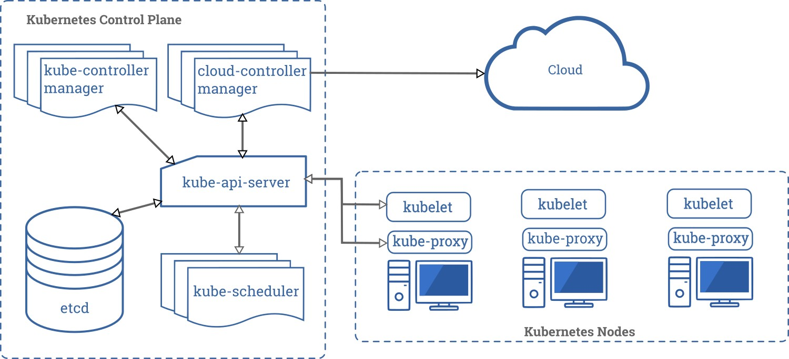

# Conceitos de Orquestração 🎭📦

Orquestradores de Containers são responsáveis pela implementação, monitoramento e controle de containers em ambientes de múltiplos servidores. Eles são essenciais para ambientes empresariais de hospedagem de aplicações.

Hoje existem diversos Orquestradores de Containers disponíveis tanto na nuvem quanto para instalações on-premises, ou locais. Entre os principais estão: Kubernetes, Docker Swarm, Openshift e Mesos.

No caso dos Orquestradores de Containers, um projeto é em geral definido de maneira declarativa e é chamado de Estado do Cluster. Basicamente nós decidimos qual é o estado desejado do ambiente e o Orquestrador irá monitorar todo o ambiente fazendo modificações para alcançar o estado desejado.

## Kubernetes 🌐​⚓

O Orquestrador de Containers mais utilizado no mercado atualmente é o Kubernetes. Kubernetes (K8s) é um produto Open Source utilizado para automatizar a implantação, o dimensionamento e o gerenciamento de aplicativos em contêiner.

[Documentação Oficial do Kubernetes](https://kubernetes.io/pt-br/docs/home/)

## O Container Engine

  Antes de começar a falar um pouco mais sobre o Kubernetes, nós primeiro precisamos entender
alguns componentes que são importantes no ecossistema do Kubernetes, um desses componentes
é o Container Engine.
  O Container Engine é o responsável por gerenciar as imagens e volumes, ele é o responsável
por garantir que os os recursos utilizados pelos containers estão devidamente isolados, a
vida do container, storage, rede, etc.
  Até pouco tempo atrás tinhamos somente o Docker para esse papel. Mas hoje já temos diversas
opções para se utilizar como Container Engine.
  Opções como o Docker, o CRI-O e o Podman são bem conhecidas e preparadas para o ambiente 
produtivo. O Docker, é o Container Engine mais popular e ele utiliza como Container Runtime o containerd.

#### OCI - Open Container Initiative

A OCI é uma organização sem fins lucrativos que tem como objetivo padronizar a criação de containers, para que possam ser executados em qualquer ambiente. A OCI foi fundada em 2015 pela Docker, CoreOS, Google, IBM, Microsoft, Red Hat e VMware e hoje faz parte da Linux Foundation.

O runc, principal projeto desenvolvido pela OCI, é um container runtime de baixo nível amplamente utilizado por diversos Container Engines, incluindo o Docker. Este projeto, totalmente open source, é escrito em Go e seu código fonte pode ser acessado no GitHub.

Agora sim já podemos falar sobre o que é o Container Runtime.

#### O Container Runtime

Para que seja possível executar os containers nos nós é necessário ter um *Container Runtime* instalado em cada um desses nós.

O *Container Runtime* é o responsável por executar os containers nos nós. Quando você está utilizando ferramentas como Docker ou Podman para executar containers em sua máquina, por exemplo, você está fazendo uso de algum *Container Runtime*, ou melhor, o seu Container Engine está fazendo uso de algum *Container Runtime*.

Temos três tipos de *Container Runtime*:

- Low-level: são os *Container Runtime* que são executados diretamente pelo Kernel, como o runc, o crun e o runsc.

- High-level: são os *Container Runtime* que são executados por um *Container Engine*, como o containerd, o CRI-O e o Podman.

- Sandbox e Virtualized: são os *Container Runtime* que são executados por um *Container Engine* e que são responsáveis por executar containers de forma segura. O tipo Sandbox é executado em unikernels ou utilizando algum proxy para fazer a comunicação com o Kernel. O gVisor é um exemplo de *Container Runtime* do tipo Sandbox. Já o tipo Virtualized é executado em máquinas virtuais. A performance aqui é um pouco menor do que quando executado nativamente. O Kata Containers é um exemplo de *Container Runtime* do tipo Virtualized.

#### Diferenças entre **Control Place** e **Workers**

 O Control Place é o cérebro, responsável por gerenciar o estado desejado. Ele decide o que o cluster deve rodar, monitor e corrigir desvios.
  O Workeres (Nós de trabalho), sõa os nós onde suas aplicações relmente rodam. ele escuta os Pods (containers da sua aplicação).

|Aspector | Control Place | Workers |
|---------|---------------|---------|
| Função| Gerenciar o cluster | Executar aplicações (Pods) |
| Responsabilidade| Decisões, agendamento, estado do cluster | Rodar containers e serviços |
| Componentes| API Server, etcd, Scheduler, Controller Manager | Kubelet, Kube Proxy, Runtime |
| Onde roda apps?| Não (salvo exceções em clusters pequenos, ex. minikube) | Sim, aqui ficam os Pods do usuário |

### Componentes

O Kubernetes é formado por uma série de componentes que compartilham um mesmo estado em um banco dedados do tipo Chave-Valor, o ETCD. A interação entre esses diversos componentes gerenciam um cluster que pode ser formado por centenas ou até mesmo milhares de containers e servidores. Podemos dividir esses componentes em 3 camadas: Os componentes do Control Plane, os componentes do Node Plane e os Addons.

 - O Control Plane é responsável pelas decisões administrativas do ambiente. Pense nele como a cabeça por trás das decisões tomadas pelo Kubernetes.
 - No Node Plane são reunidos os componentes que são executados em todos os servidores do Cluster. Nele temos os componentes que gerenciam os container e rede dos servidores. 
 - Por fim, os Addons são componentes que usam recursos do Kubernetes para adicionar capacidades extras ao Cluster.

##### Kube-apiserver
```
  O Kube-apiserver é o componente que dá acesso ao Control Plane e é a 
  porta de entrada do cluster. Todo acesso ao cluster é mediado por esta 
  API. Quando executamos um comando através do executável kubectl, 
  estamos fazendo uma chamada a API do Kubernetes, que está sendo mantida 
  pelo kube-apiserver.
```
##### ETCD
```
  Todos os dados do Kubernetes são mantidos no ETCD, que é um banco de dados
  do tipo chave-valor baseado em consenso. Nele o Estado do Cluster é 
  mantido e por isso o ETCD prioriza a consistência dos dados sobre 
  disponibilidade.

  E possível manter árias réplicas do ETCD ativas ao mesmo tempo, e mesmo a 
  falha de uma delas não afetará a disponibilidade do ambiente e integridade 
  dos dados do Kubernetes.
```

##### Kube-scheduler
```
    O Kube-scheduler é o responsável por determinar em que servidor cada 
    pod será iniciado e executado. Para tomar esta decisão ele leva em 
    conta diversas questões, como disponibilidade de recursos, políticas 
    aplicadas às cargas de trabalho e atribuições especiais 
    vindas do usuário.
 ```

##### Kube controller manager
```
  O Kube-controller-manager é responsável por gerir as tarefas 
  administrativas do cluster. Nele, diversos Controladores com diversas 
  responsabilidades distintas são executados a fim de manter o estado do 
  cluster atualizado.
```
##### Endpoints Controller 📈​
```
    O Endpoint Controller é responsável por adicionar Endpoints, ou IP’s 
    de Pods, a lista de Endpoint de um Service. Ele observa as regras 
    definidas no campo Selector de um Service para descobrir que Pods 
    devem ser adicionados a lista, tornando possével a descoberta de 
    Serviço de forma fácil e prática usando DNS e Services.
```

##### Kubelet
 ```
    O Kubelet é o processo responsável por iniciar os containers definidos 
    nos pods. Ele conversa com o Container Runtime instalado no servidor 
    garantindo a execução e a saúde dos containers definidos no Estado do 
    Cluster.
 ```

## Principais Conceitos 💻​

### Cluster

Conjunto de máquinas (físicas ou virtuais) que trabalham juntas para executar aplicações em containers. Um cluster Kubernetes contém pelo menos:

- Um **control plane** (plano de controle)
- Um ou mais **nodes** (nós) onde os aplicativos são executados

---

### Node

É uma máquina (física ou virtual) dentro do cluster responsável por executar os **pods**. Existem dois tipos:

- **Master node** (controla o cluster)
- **Worker node** (executa os aplicativos)

---

### Pod

A menor unidade implantável no Kubernetes. Um **pod** pode conter um ou mais containers que compartilham:

- A mesma rede/IP
- Armazenamentos
- Ciclo de vida

---

### Deployment

Objeto responsável por definir **como e quantas vezes** uma aplicação deve rodar. Gerencia a criação, atualização e escala dos pods.

Exemplo de definição:
```yaml
apiVersion: apps/v1         # Define a versão da API do Kubernetes que será usada para esse recurso (aqui: apps/v1, usado para Deployments).
kind: Deployment            # Indica o tipo de recurso que está sendo criado, neste caso um Deployment.
metadata:
  name: meu-app             # Nome do Deployment, que serve como identificador dentro do cluster.
spec:
  replicas: 3               # Quantidade de réplicas (pods) que o Deployment deve manter em execução.
  selector:                 # Define como o Deployment vai identificar quais Pods pertencem a ele.
    matchLabels:            # Critério de correspondência: procura Pods com o rótulo abaixo.
      app: meu-app          # Rótulo usado para identificar os Pods que fazem parte deste Deployment.
  template:                 # Template que descreve como os Pods desse Deployment devem ser criados.
    metadata:
      labels:
        app: meu-app        # Rótulo que será adicionado aos Pods criados (precisa bater com o selector acima).
    spec:
      containers:           # Lista de containers que irão rodar dentro de cada Pod.
        - name: nginx       # Nome do container (apenas identificador dentro do Pod).
          image: nginx      # Imagem Docker que será usada para criar o container (nesse caso, a imagem oficial do Nginx do Docker Hub).
          ports:
            - containerPort: 80  # Porta exposta pelo container (nesse caso, o Nginx escuta na porta 80).

```

### Service
Define uma forma de expor os pods como um serviço de rede. Tipos comuns:
 - ClusterIP (interno ao cluster)
 - NodePort (acesso externo via porta do node)
 - LoadBalancer (exposição externa com balanceamento de carga)

### Volume
Volumes fornecem armazenamento persistente para os pods. Eles mantêm dados mesmo se o pod for recriado
Tipos comuns de volumes:
 - emptyDir
 - hostPath
 - persistentVolumeClaim (PVC)

### Namespace
Permite organizar e isolar recursos dentro de um mesmo cluster. Muito útil em ambientes com múltiplos times ou projetos.
Exemplo: `kubectl create namespace meu-projeto`

### Kubectl
```
O Kubectl é a forma mais básica de se gerenciar um cluster Kubernetes. Através da combinação de seus comandos é possével 
gerenciar e monitorar todo o cluster.
Ele é um executável extremamente leve disponível para a maioria dos sistemas operacionais e pode controlar clusters locais ou remotos.
```

## Comandos Básicos com kubectl
```
# Listar pods
kubectl get pods

# Listar serviços
kubectl get services

# Aplicar um arquivo YAML
kubectl apply -f deployment.yaml

# Deletar um recurso
kubectl delete pod nome-do-pod

# Ver logs de um pod
kubectl logs nome-do-pod

# Executar comando dentro do pod
kubectl exec -it nome-do-pod -- bash
```

## Portas utilizados pelos componentes do Kubernetes

  - 6443 (TCP) → entrada no cluster (API Server)
  - 2379–2380 (TCP) → armazenamento do estado (etcd)
  - 10250 (TCP) → comunicação entre API Server e nós (Kubelet)
  - 10251 (TCP) → scheduler
  - 10252 (TCP) → controller manager

  > Uma porta TCP é um número que funciona como um ponto de entrada e saída numa rede, associado a um aplicativo específico num dispositivo