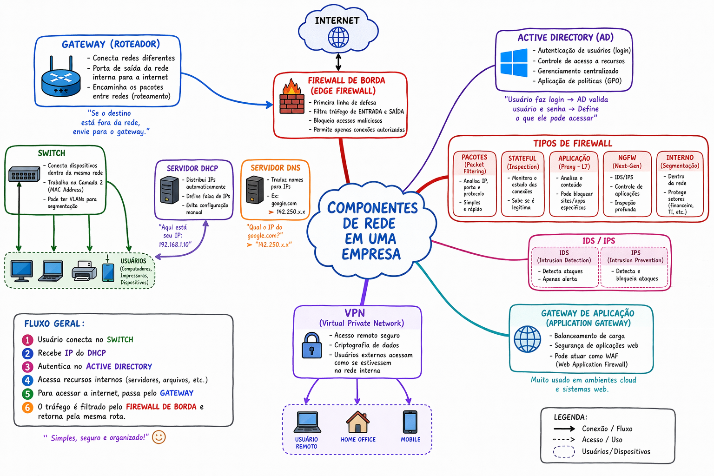

## Componentes de uma rede corporativa

- **Gateway**
  - O gateway é o dispositivo responsável por conectar redes diferentes.
  - Atua como “porta de saída” da rede
  - Exemplo: O computador quer acessar o Google → ele envia a requisição para o gateway → o gateway encaminha para a internet.

- **Roteador (Router)**
  - Responsável por encaminhar pacotes entre redes.
  - Conecta redes internas com externas
  - Pode atuar como gateway
  - Usa tabelas de roteamento

- **Switch**
  - Dispositivo que conecta dispositivos dentro da mesma rede.
  - Trabalha na camada 2 (MAC Address)
  - Permite comunicação entre máquinas locais
  - Pode ter VLANs

- **Servidor DNS**
  - Ele gerencia recursos internos
  - Acelera o acesso à internet por meio de cache 
  - Aumenta a segurança ao bloquear sites maliciosos 
  - Traduz nomes para IPs.
  >[!NOTE]  
  > Permite que funcionários acessem recursos internos da empresa (como servidores de arquivos, impressoras ou intranets) usando nomes amigáveis (ex: servidor-arquivos.empresa.local) em vez de endereços IP numéricos.

- **VPN (Virtual Private Network)**
    - Permite acesso remoto seguro à rede da empresa.
    - Criptografia de dados
    - Usuários externos acessam como se estivessem na rede interna

- **Tunelameno (Tunels)**
  - O tunelamento em redes é uma técnica que permite a transmissão de dados de uma rede através de outra rede
  - Processo de encapsulamento.

> [!NOTE]  
> Diferença entre tunelamento de rede e vpn  
> **Tunelamento** (Técnica): É o método de *transporte*. Ele cria o caminho virtual, envolvendo o tráfego em "envelopes" (protocolos como PPTP, L2TP, IPsec) para que ele atravesse a rede, mas nem sempre criptografa os dados.  
> **VPN** (Serviço): É a aplicação final. A VPN usa o tunelamento e adiciona uma camada robusta de *criptografia* (especialmente IPSec ou TLS) para garantir confidencialidade e segurança, ocultando o tráfego do provedor de internet e de terceiros.

- **Firewall de Borda**
  - O firewall de borda fica na “fronteira” entre a rede interna e a internet.
    - Filtrar tráfego de entrada e saída
    - Bloquear acessos maliciosos
    - Permitir apenas conexões autorizadas

### Tipos de firewall

**Firewall de Pacotes (Packet Filtering)**
  - Analisa IP, porta e protocolo
  - Mais simples e rápido
  - Menos inteligente

**Firewall Stateful (Stateful Inspection)**
  - Monitora o estado das conexões
  - Sabe se uma conexão é legítima
  - Muito usado em empresas

**Firewall de Aplicação (Proxy / Layer 7)**
  - Analisa o conteúdo do tráfego
  - Pode bloquear sites específicos
  - Ex: bloquear redes 
