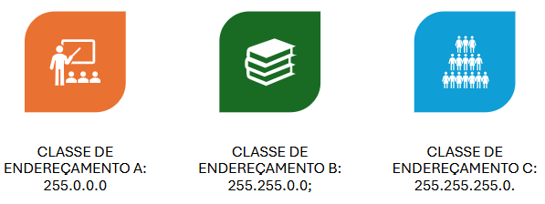
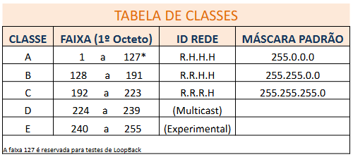

# Rede de Computadores

## 1. Conceitos Básicos de Redes
- **Rede de Computadores**: Conjunto de dispositivos interconectados que compartilham recursos e informações.
- **Tipos de Redes**:
  - **LAN (Local Area Network)**: Rede local, geralmente dentro de uma empresa ou residência.
  - **WAN (Wide Area Network)**: Rede de longa distância, interliga várias LANs.
  - **MAN (Metropolitan Area Network)**: Rede metropolitana, cobre áreas urbanas.
  - **VPN (Virtual Private Network)**: Rede privada virtual, criptografa conexões pela internet.

## 2. Componentes de Rede
- **Switch**: Dispositivo que conecta vários equipamentos em uma LAN.
- **Roteador**: Faz a ligação entre redes diferentes e direciona pacotes.
- **Firewall**: Filtra e protege a rede contra acessos indevidos.
- **Servidor**: Fornece serviços como arquivos, banco de dados, e-mail.
- **Access Point (AP)**: Expande a rede sem fio (Wi-Fi).
- **Cabo de Rede (Ethernet)**: Meio físico para transmissão de dados.
- **Patch Panel**: Organização física dos cabos de rede em racks.

## 3. Endereçamento IP

Um endereço IP é uma sequência de números separados por pontos, representado por um conjunto de quatro números conhecidos como octetos, como por exemplo 192.158.1.38. 
Excemplo: **192.168.100.1**
1st octet: 192  --> 11000000
2st octet: 168  --> 10101000
3st octet: 100  --> 01100100
4th octet: 001  --> 00000001

A máscara de rede tem 32 bits, assim como o endereço IP, tendo como finalidade mascarar uma parte do endereço IP, assim, todo endereço IP tem uma máscara correspondente, servindo para identificar qual parte do endereço é da rede e qual é a do host.

- **IPv4**: Endereços de 32 bits (ex: 192.168.0.1).
  - Classes: A, B, C, D e E.
  - Sub-redes: Criadas com **máscara de sub-rede** (ex: 255.255.255.0).
- **IPv6**: Endereços de 128 bits, mais modernos e praticamente ilimitados.
- **CIDR (Classless Inter-Domain Routing)**: Método de alocação de IPs sem depender de classes fixas.

### Máscaras de Sub-rede Comuns (IPv4)

### Classes
Quando o IPv4 foi criado, os endereços IP foram divididos em faixas chamadas de “classes”, para organizar o tamanho das redes.
Cada classe define:
- Quantos bits são usados para a parte da rede e a parte do host;
- Quantos hosts (computadores) podem existir;
- E qual faixa de endereços IP ela usa.

| Classe | Primeiro octeto | Faixa de IPs                | Bits de Rede | Bits de Host | Nº de Hosts por Rede | Exemplo     |
| ------ | --------------- | --------------------------- | ------------ | ------------ | -------------------- | ----------- |
| **A**  | 1 – 126         | 1.0.0.0 – 126.255.255.255   | 8            | 24           | 16.777.214           | 10.0.0.0    |
| **B**  | 128 – 191       | 128.0.0.0 – 191.255.255.255 | 16           | 16           | 65.534               | 172.16.0.0  |
| **C**  | 192 – 223       | 192.0.0.0 – 223.255.255.255 | 24           | 8            | 254                  | 192.168.0.0 |

- /24 → 255.255.255.0 → 254 hosts possíveis (Classe C)
- /16 → 255.255.0.0 → 65.534 hosts possíveis (Classe B)
- /8 → 255.0.0.0 → 16.777.214 hosts possíveis (Classe A)

## Protocolos de rede

Funcionam como uma linguagem universal para que dispositivos distribuídos ao redor do mundo possam se comunicar de forma padronizada.

A rede é dividida em camadas, cada uma com uma função específica. Os diversos tipos de protocolos de rede variam de acordo com o tipo de serviço utilizado e a camada correspondente.

### 4. Protocolos de Comunicação
- **TCP/IP**: Conjunto de protocolos usados na internet e redes corporativas.
- **UDP**: Mais rápido que TCP, usado em streaming e jogos online.
- **HTTP/HTTPS**: Protocolo da web.
- **FTP/SFTP**: Transferência de arquivos.
- **DNS**: Traduz nomes de domínio em endereços IP.
- **DHCP**: Atribui IPs automaticamente aos dispositivos.

## 5. Topologias de Rede
- **Barramento**: Todos compartilham o mesmo cabo.
- **Anel**: Dados circulam em um laço fechado.
- **Estrela**: Dispositivos conectados a um switch/roteador central.
- **Malha**: Todos conectados entre si (redundância).
- **Híbrida**: Combinação de topologias.

## 6. Segurança de Rede
- **Criptografia**: Garante confidencialidade dos dados.
- **Autenticação**: Confirma a identidade dos usuários.
- **Controle de Acesso**: Define permissões na rede.
- **IDS/IPS**: Sistemas de detecção e prevenção de intrusões.
- **Segmentação de Rede (VLANs)**: Separa setores da empresa para maior segurança.

## 7. Infraestrutura de Rede em Empresas Grandes (Intranet Corporativa)
- **Data Center**: Estrutura centralizada de servidores.
- **Redundância**: Equipamentos e links duplicados para evitar falhas.
- **Balanceadores de Carga**: Distribuem tráfego entre servidores.
- **QoS (Quality of Service)**: Prioriza tráfego crítico (ex: VoIP).
- **Monitoramento (SNMP, Zabbix, Nagios, Prometheus)**: Acompanha desempenho da rede.
- **Políticas de Backup e Disaster Recovery**: Garantem continuidade dos serviços.

## 8. Planejamento de Endereçamento em Grandes Empresas
- Separar IPs por setores:
  - Administração: 192.168.10.0/24
  - Financeiro: 192.168.20.0/24
  - TI: 192.168.30.0/24
  - Produção: 192.168.40.0/24
- Utilizar **VLANs** para segmentação lógica.
- Implementar **VPN** para acesso remoto seguro.
- Utilizar **IPv6** em paralelo ao IPv4 (dual stack).

### Endereçamento IP

## 10. Tecnologias Avançadas
- **SDN (Software Defined Networking)**: Controle programável da rede.
- **Cloud Networking**: Integração com serviços de nuvem (AWS, Azure, GCP).
- **Edge Computing**: Processamento próximo aos dispositivos finais.
- **5G e IoT**: Novas demandas de rede em empresas modernas.

---
